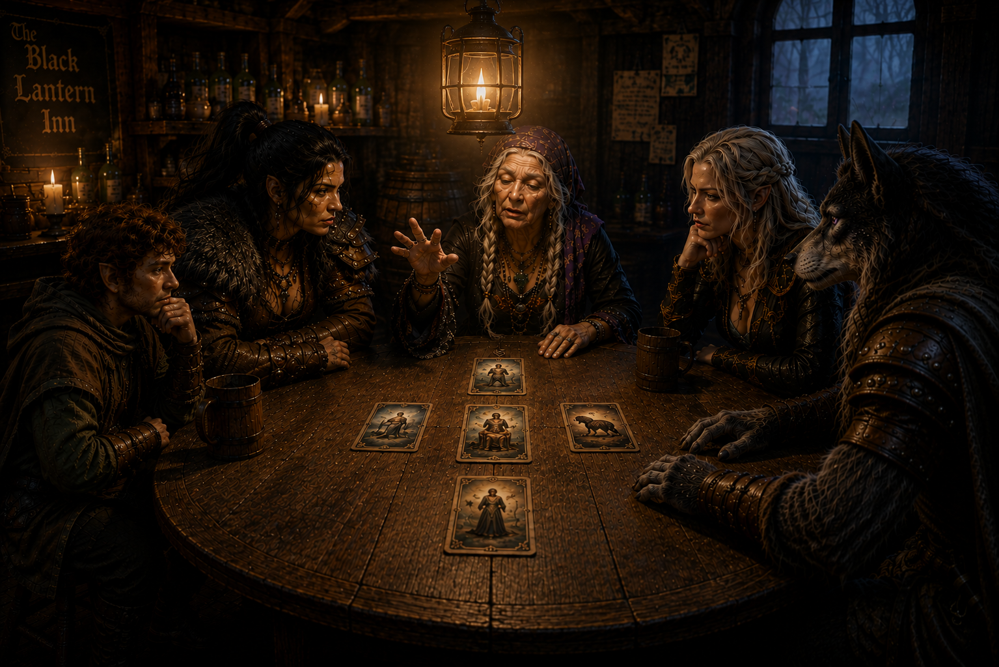

# The Shadows of Crawford

> *The Mists had delivered Ravenlost somewhere new. Crawford, unfortunately, already had problems of its own.*

---

## Madam Eva's reading

The Black Lantern Inn was empty, dark, and abandoned. At least, it had been until Madam Eva walked through the door.

She appeared to be around eighty years old, her fingers covered in rings. She introduced herself simply as a traveler and asked whether there was a room available. With a wave of her hand, the lights throughout the inn flickered to life—including the one in the office where Cadric had been hiding.

The halfling emerged and promptly closed and locked the front door. Outside, the Mists were creeping closer. When he asked Madam Eva about them, her answer offered little comfort. The Mists followed here.

Bia, meanwhile, had discovered three barrels behind the bar. Two were empty. The third contained mead. With drinks distributed, everyone gathered around a table. Madam Eva raised her hand. Every light in the inn went dark except the one hanging above them.

Then she produced a deck of cards. Her head tilted backward before snapping forward again. Her eyes had turned murky, staring somewhere far beyond the room. She shuffled. Then she drew five cards.

- **The Mists.** A journey lay ahead. The Mists might claim those who were not careful.

- **The Miser.** A lord ruled from a mansion and refused to surrender to something he feared more than death.

- **The Dictator.**

- **The Beast.** Cadric immediately pointed at Jayn.

- **The Darklord.**

Madam Eva drew four more cards, placing each over one already on the table: the Berserker over the Dictator, the Charlatan over the Darklord, the Shepherd over the Beast, and the Ghost over the Miser.

Then, just as suddenly as the trance had begun, Madam Eva returned to herself. She asked what they thought. Ravenlost, unusually, had very little to say. 

Madam Eva rose to leave. Somehow, the front door that Cadric had locked opened for her, and she disappeared into the fog. The Mists remained pressed against the doorway.

Cadric suspected the cards represented people they either already knew or would someday meet.

For the moment, however, there was nowhere to go.

---

## A night surrounded by Mists

Jayn asked Cadric to play something, and the bard obliged. Eventually, Jayn and Elisandra went upstairs to explore the inn. A short while later, Elisandra screamed.

Bia and Cadric raced upstairs. As they hurried down the hall, Jayn suddenly leapt from one of the rooms, screamed at Cadric, grabbed him, and lifted him from the floor. She and Elisandra burst into laughter. Cadric didn't appreciate the joke.

Meanwhile, they determined that the rooms upstairs had looked abandoned for years. But their exploration revealed something more troubling. The Mists had pressed themselves against every window. Ravenlost was surrounded. With no obvious way out, they settled in for the night and took turns keeping watch.

By morning, sunlight had begun to break through, but the Mists remained. There would be no avoiding them. The only question was where to go.

Cadric remembered the ghost from the laboratory mentioning Griffin Hill and recalled that it was located in Mordent, to the north. With no better destination, Ravenlost decided to head toward the city of Mordenshire in Mordent.

Before entering the fog, they tied themselves together with rope. Then Jayn took the lead.

---

## Through the Mists

The fog swallowed them almost immediately. It was so thick that even while tethered together, the companions could barely see one another.

Along the way, Jayn spotted a body impaled upon a pike and decided that whatever lay in that direction was probably somewhere Ravenlost didn’t want to be.

She turned. One by one, however, each member of the party encountered the same body. Cadric stopped long enough to examine it and discovered a falcon branded into the victim's chest. 

Somewhere in the fog, Jayn saw another light and heard the sound of wheels rolling across the ground. She called out.

The others caught up to find her speaking with a traveling salesman named Parry, proprietor of **Parry's Potables**. He wore a jeweled charm shaped like a mask around his neck, and his wagon carried an assortment of potions.

Parry told them that was heading toward the metropolis of Dementlieu. More importantly, he had merchandise.
Jayn showed him the red vials she had taken from Glim Brightstone's laboratory. Parry identified them as healing potions. He had four more available for fifty gold each. Cadric negotiated a group discount for the lot, and Ravenlost also purchased a disguise potion for Jayn.

When Parry continued on his way, Cadric briefly contemplated going with him. But he did not, and Ravenlost continued through the Mists.

Time became increasingly difficult to judge. Day seemed to become night and then day again without warning. After what felt like six hours of walking, the fog finally began to thin.

---

## Locust Branch Hospital

Jayn emerged from the Mist first. From the sunlight, it appeared to be around nine in the morning, although even her compass seemed wrong.

Ravenlost had arrived in a marsh. Beyond it stood a pond, woods, and an enormous building. Strange glowing lights—like softball-sized fireflies—floated nearby.

After approximately two hours of trudging through the marsh, the group reached a fence surrounding a massive domed structure in severe disrepair. A damaged sign identified it:

**Locust Branch Hospital**

Closer inspection revealed the rest.

**Condemned under the act of death**

The front entrance had been nailed shut, but a cracked window offered another way inside. There were no obvious signs of life.

Naturally, Jayn climbed through the window. Bia followed, injuring her hand in the process. Cadric wisely remained near the fence.

Near the building, Elisandra consulted her Augury, and it informed her that going inside was a bad idea. That was enough for Bia. She climbed back out.

Jayn was now alone inside an abandoned hospital ward. Through a set of swinging doors, she noticed something shiny. Then a bandaged arm reached through and picked it up.

A man with a dog approached the fence where Cadric stood. He introduced himself as Lavar and explained that he was a guard at the hospital. When Lavar learned that Jayn was inside, he immediately began banging on the fence and yelling for her to get out. Reluctantly, Jayn complied. Upon emerging, she peed near Lavar.

Introductions were going well.

---

## The missing people of Crawford

Lavar explained that Locust Branch Hospital was extremely dangerous. He was arriving for his shift, but the guard he was supposed to replace—Daverick—was nowhere to be seen. That was particularly concerning because Crawford had recently experienced a series of disappearances.

Lavar suggested Ravenlost visit the Raven's Claw Inn, where the townspeople were holding a meeting about the missing residents. Perhaps Daverick had simply left his shift early to attend. 

He also told them that Mordenshire remained approximately a day and a half away. As it was, they were outside the town of Crawford. The town was governed by Sterling Crawford, who had shut himself inside his manor several months earlier after his pregnant wife became ill.

Jayn decided to ask Lavar's dog, Pablo, what he knew. 

Pablo knew quite a bit. Ghosts surrounded the hospital. Every night at eleven, for example, a ghost named Cynthia slammed herself against one of its windows. More troublingly, Pablo could not smell Daverick along his usual route to work. At the dock, however, he caught Daverick's scent.

Ravenlost left Lavar and Pablo behind and headed into Crawford.

---

## The town meeting

They entered the Raven's Claw Inn just as a man was announcing that a third family had disappeared in only nine days.

Most of those gathered were farmers. Among them was the local clergyman and Thom Youngblood, Crawford's de facto leader. Thom explained the pattern.

- Nine days earlier, Lone Farmer John had disappeared.
- Five days earlier, the Peterbuild family—a husband, wife, and son—had vanished after neighbors noticed there was no longer smoke coming from their chimney.
- The previous night, Stern and Persephone Reynolds had disappeared.

Entire households were vanishing. There were no signs of robbery. No forced entry. No obvious struggle.
Ravenlost began asking questions.

The town storekeeper, Ron, operated Larder Supply and supplied goods to Crawford Manor. Sterling Crawford normally received weekly shipments of grain, meat, linens, and other necessities. Until recently, the shipments had also included baby furniture and supplies, but those requests had stopped. Also, the latest shipment had never arrived. It was already four days overdue. If Ravenlost found it, they could keep it. 

Sterling's wife had been approximately four months pregnant when he withdrew from public life to care for her. The manor itself was managed by Thema, an elderly gnome caretaker who, by all accounts, ruled it with an iron fist. She was perhaps three hundred years old and roughly Cadric's size.

There was also a troubling geographic pattern. Of the missing households, Lone Farmer John lived closest to Crawford Manor. The Peterbuilds were next closest. Then the Reynolds.

---

## Daverick's tea

Before investigating the missing families, Ravenlost decided to check on Daverick. His house was different from the others. Rather than living near the manor, he lived on the same side of the river as the inn, church, dock, and hospital.

Jayn knocked, but the door wasn't closed. Inside was a simple home with humble furnishings and an unmade cot. The back door also stood open. 

Then they noticed something that didn’t belong: a beautiful porcelain teapot and cup. Inside the teapot, the party found small white flowers that Bia couldn’t identify. And the remaining tea had a strong, astringent smell.
Outside, near the river, Jayn discovered a large boot print that appeared to lead directly into the water. 

They returned to the Raven's Claw Inn, where the clergyman identified the flowers: Hemlock. A paralytic. The plant was native only to Echo Island—an island that the townsfolk of Crawford wouldn’t typically venture to.
The porcelain provided another connection. Something so fine would be far beyond Daverick's means. The Crawford family, however, could easily own it.

There was one more connection. Before becoming the hospital's night guard, Daverick tended the grounds at Crawford Manor.

The priest also revealed more about Mrs. Crawford. Sterling had sought his help several months earlier, when his wife was approximately six and a half months pregnant. The priest had gone to the manor and provided herbs in hopes of treating her illness. They didn’t work. Sterling banished him from the estate and decided to care for his wife himself.

Ravenlost was becoming increasingly certain that something was wrong at Crawford Manor. But before storming the manor, they wanted evidence.

---

## The houses of the missing

The Reynolds' house provided that evidence. Near the river, Jayn discovered two sets of footprints made by the same size boot. One set, however, had pressed much deeper into the ground than the other. 

Inside, the table had been set for three. Two places held empty cups, and there was no teapot. The cups contained residue carrying the remains of the same distinctive smell as the tea found in Daverick's house.
Jayn also discovered three strands of hair: one medium-length and stark white, another medium-length and brown, and one long and blonde.

The party continued to the homes of the Peterbuilds and Lone Farmer John. Both houses were strangely clean and undisturbed. John's home was almost too pristine for such a humble dwelling. Neither house contained the tea service or any other obvious clue.

Back at the inn, Ravenlost compared what they had found with the people gathered there. Most of the farmers had brown hair. Ron's was red. No one matched the white hair.

The clergyman helped identify the others. Stern Reynolds had medium brown hair. His wife Persephone had long blonde hair. And Thema, the elderly gnome caretaker of Crawford Manor, had white hair.

The evidence continued to point in one direction.

---

## What waited beneath the pond

Two other families lived near Crawford Manor: the Lemroys and the Darrons. Both had decided to stay at the Raven's Claw Inn for safety.

Because Earnest and Ella Lemroy lived closest to the manor, Ravenlost asked permission to watch their house that night. The Lemroys agreed to let them stay in their barn.

Before nightfall, however, Jayn and Bia had another place they wanted to investigate. The pond. Each borrowed—or, depending on one's definition, confiscated—a boat from the dock.

From the water, they noticed a light briefly appear inside the hospital before going dark again. And at Crawford Manor, a single light burned.

Jayn investigated the place where the river's current emptied into the pond. She plunged her hand into the silt and pulled out a human skull. Deep, uneven scrapes marked the bone. They didn't appear to have been caused by metal. Whether the damage occurred before or after death was impossible to tell.

Bia searched farther out. She dove into the middle of the pond and discovered a burlap sack weighted to the bottom with a rock. She removed the weight and brought the sack ashore.

Inside were three more old sacks. Each contained the bones of an infant.

Whatever was happening in Crawford had suddenly become much darker.

---

## The perfect plan

Night had fallen. Rather than return to the inn, Ravenlost carried what they had found to the Lemroys' barn and prepared to watch the house. Preferring to stay in the house, Cadric easily unlocked the door.

Now they needed a plan.

The Lemroys were halflings. Conveniently, so was Cadric. Therefore, Cadric would be the bait.
He objected. The plan continued.

Cadric would disguise himself as Earnest Lemroy and wait inside the house. Jayn would hide beneath the bed. Elisandra would remain in the open barn watching for anyone approaching from the direction of the river. If she saw someone, she would warn Cadric telepathically. Bia would keep watch from the barn roof.

It was the perfect plan.

Several hours passed. Then, around 11:30 that night, Bia spotted a four-foot-tall hooded figure emerging from the woods. It carried a pouch and what looked like a kettle.

Elisandra happened to be facing the wrong direction, so Bia tapped on the barn roof to warn her. Then Elisandra warned Cadric.

The bard assumed his disguise and waited. Someone knocked.

"Who is it?"

No answer. Cadric opened the door. The hooded figure held out a cup.

"Drink."

Cadric drank. He couldn’t stop himself. The liquid tasted vile, and within moments, he was completely paralyzed.
The figure entered the house and whistled. Bia jumped from the roof and attacked as it passed through the doorway. Her axe cut through the cloak and missed. There was nothing underneath. Jayn cast her Hunter’s Mark before emerging from under the bed.

Then the figure vanished. The kettle—still filled with poisoned tea—and a lantern dropped to the floor.
Outside, Elisandra heard something nearby, followed by the sound of water moving toward the creek. Jayn rushed from the house and saw a black figure flying toward Crawford Manor.

The trap had worked. Mostly.

Cadric remained paralyzed for the next fifteen minutes or so. Fortunately for everyone except Elisandra, paralysis didn’t prevent him from communicating telepathically. She briefly considered moving beyond the twenty-foot range of the spell.

Bia eventually lifted Cadric onto the bed, apparently at his request. And with their visitor gone, Ravenlost settled in for the rest of the night.

---

## Shadows by the fire

Elisandra took the first watch. At approximately 1:30 in the morning, Cadric relieved her. He lit the fire and dragged furniture in front of both doors.

Then, while he was keeping watch—or perhaps cowering—the light in the room began to dim. Cadric turned toward the fire to restoke it. Instead, he saw three shadowy figures standing around it.

He screamed. Everyone woke.

The battle was brief. Ravenlost destroyed one of the creatures, but the remaining two fled into the night.
Nothing else disturbed them that night.

---

## The road to Crawford Manor

Ravenlost returned to the Raven's Claw Inn around 9:30 the following morning. They brought the bones from the pond with them. Then they told Thom Youngblood everything.

Thom already knew that undead creatures haunted Locust Branch Hospital. Until now, however, he hadn't been certain that something equally sinister was happening at Crawford Manor. Now he was.

The townspeople would have no objection if Ravenlost decided to storm the estate. 

Thom had visited Crawford Manor a few times as a child, although he had never gone far inside. From memory, he provided them with a rough map of the grounds and the small portion of the manor he had seen.

Before they left, he revealed one final detail. Mrs. Crawford had been pregnant once before. That child had not survived.

Ravenlost now had poisoned tea, missing families, a mysterious caretaker, flying figures, infant bones recovered from the pond, and a trail that seemed to lead directly toward Sterling Crawford's estate.

There was only one place left to investigate.

**Crawford Manor**.
