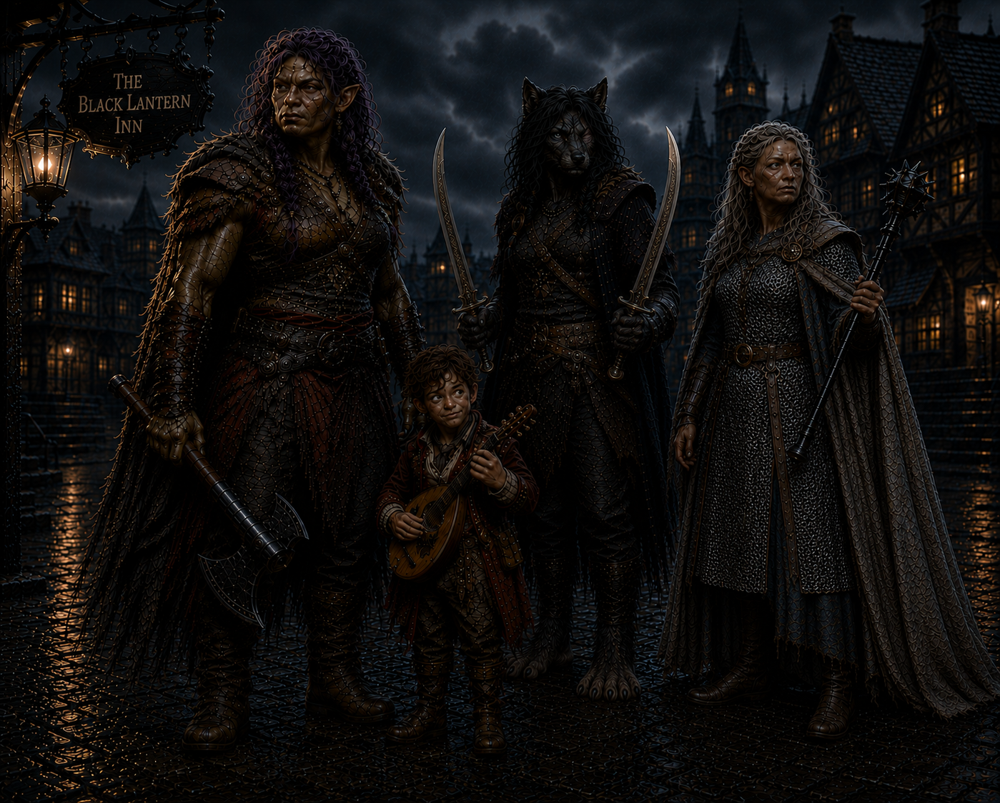

# Four strangers in the Mists

> *The Mists have a way of gathering those who were never meant to meet*

---

## The Black Lantern Inn

The Black Lantern Inn stood in the Mists as though it had been waiting for them.

One by one, the four strangers entered its taproom and asked about the advertised job.

- **Bia Galene**, a six-foot-six female Orc barbarian
- **Cadric Veyl**, a three-foot-tall Halfling bard with sandy hair and hazel eyes, weighing only thirty-two pounds
- **Jayn Blight**, a six-foot-four female Lupine ranger with gunmetal-colored fur, a purple left eye, and a scar crossing her right eye
- **Elisandra Corvis**, a six-foot-tall Kalashtar cleric with pure white hair

The bartender offered little explanation. He merely directed each of them toward a room off the bar, where their prospective employer waited. Jayn Blight was the last to join them. Before doing so, she remained at the bar long enough to drink two bowls of grog. 

Inside the office sat an older gentleman dressed in clothing that was fine but worn with age. A book rested in his hands, and he appeared absorbed in its pages until all four adventurers had gathered before him. He introduced himself as **Henry Loust**.

Henry explained that he acted on behalf of **Lady Estella Godfroy**, of the Mordent Godfroys. His patroness wanted something recovered from an old church to the north, high on a nearby mountain. The church had long ago been converted into a chemical laboratory by a dwarf alchemist named **Glim Brightstone**, who had vanished nearly sixty-five years earlier.

Their task sounded simple: reach the laboratory and search for Glim Brightstone's journal. The journey would take approximately eight hours on foot through the woods.

Henry then admitted that another group had accepted the same assignment. Three treasure hunters had departed five days earlier and had not returned.

The warning did not discourage Cadric. Instead, the bard turned his attention to the matter of payment. By the time the discussion ended, he had persuaded Henry to give each of them one hundred gold in advance.

The four accepted the job. Before leaving the inn, Jayn drank two more bowls of grog. Then, at approximately two in the afternoon, the strangers set out together.

---

## The road north

For the first several hours, the journey through the woods was quiet.

The path climbed gradually toward the mountain while the trees crowded closer around them. Somewhere around the halfway point, Jayn heard a snap of branches, and she went off to investigate. Alone, she noticed tracks unlike any she had seen before. Each footprint showed five toes, but no heel. Coming back to the group, she said nothing.

Darkness overtook them before they reached the church. Elisandra's sword began to shine, casting enough light for her to see the path ahead. The others relied on their natural night vision as they moved deeper into the forest.

At last, the church emerged in the distance. Moonlight reflected from its stained-glass roof. Even from afar, the structure appeared enormous—far larger than the abandoned mountain chapel they might have expected to find. Then a howl broke the silence.

Jayn answered it (presumably informing them that there was a nice, tasty, morsel of a halfling with her), and a wolf charged from the darkness, snarling as it came. Three more followed close behind.

The four strangers fought together for the first time. Whatever uncertainty existed between them had to be set aside until all four wolves lay defeated. Once the forest fell quiet again, the party continued toward the waiting church.

---

## Blood at the threshold

The building loomed above them when they reached its entrance.

Runic writing had been etched into the surrounding stone. Overhead, they could see two silver discs — each approximately fifteen feet across — on separate parts of the structure’s roof. Blood marked the ground outside. Its trail continued through the entrance.

Cadric went in first and found two bodies lying on the floor, both covered in blood. Each appeared to have been killed by a long, sharp object. Elisandra examined the area and found some strange five-toed, heel-less footprints, the same that Jayn had seen but not disclosed.

Symbols had been carved throughout the entrance chamber. Farther inside stood a wooden door reinforced by decorative metal bands. The metal shone brightly enough to illuminate an inscription:

***Come as one***

The message left little room for interpretation. The four joined hands and crossed the threshold together. The first door led to a second, and again they passed through as one. After closing the door behind them, Ravenlost entered a vast, dark chamber.

Furniture had been scattered throughout the room: tables, an armoire, and some bookcases. Three obelisks stood in a triangular arrangement, each connected to wires that ran in different directions. Levers were positioned along those lines, while a round dais occupied the center of the triangle.

A gangway rose to the left, and two smaller rooms opened to the right. At the far end of the chamber, a humanoid figure sat motionless behind a desk.

---

## The laboratory awakens

The group spread out to investigate.

Elisandra entered one of the side rooms and discovered that it was being used for storage. A lever stood inside. She followed the attached wire and found that the circuit remained open. Elsewhere, the party searched for evidence of Glim's journal but found nothing.

Bia entered another room and discovered a heap of mechanical body parts—arms, legs, and torsos assembled in a style unlike anything found on an ordinary corpse. She pulled a nearby lever. One of the obelisks began filling with light.

Just then, an arm reached toward her. Startled, Bia screamed, retreated from the room, and slammed the door shut behind her.

Jayn opened it again to investigate. This time, a mechanical torso lurched forward. She also found a small steampunk, animal-like creature among the parts. After observing it, she realized that it was attracted to metal and capable of damaging any metal it touched.

Naturally, Jayn attached a rope to the creature and used it as a leash.

The group eventually opened the room fully and prepared to fight the animated pieces. Bia left her metal weapons behind, unwilling to risk having the strange creature destroy her greataxe or any of her handaxes. Cadric attempted to play his lute to see how the constructs might respond. The music only drew the crawling body parts toward him.

The party fought and destroyed the animated pieces. Once the danger had passed and all three obelisks were activated, and their light filled the laboratory.

The search resumed. They found old, empty alchemical vials, several books on alchemy, and five long, narrow copper tubes. Still, they could find no conventional journal. Their attention then returned to the humanoid figure at the desk.

As the party moved the figure toward the central dais, they noticed a hole in its skull. The opening was exactly the right size to hold a copper tube.

Before they could place the heavy figure upon the dais, Elisandra heard something overhead. She had moved to the upper level and now stood nearer the glass ceiling. Tapping and cracking noises came from above. Bia and Cadric continued struggling with the figure. Then the ceiling shattered.

---

## Creatures through the glass

Five monsters crashed through the stained glass. Two died on impact. The remaining three survived the fall and attacked.

None of the adventurers recognized them. Their feet were sharply arched, forcing them to walk high upon their toes. They resembled the strange tracks the party had followed through the forest and found beside the dead treasure hunters.

Ravenlost defeated the creatures, though the attack raised more questions than it answered.

With the immediate threat gone, the group returned to the figure and inserted one of the copper tubes into the opening in its skull. The automaton awakened at once.

His name was **Cedgewick**, a helpful butler created by Glim. Cedgewick examined the creatures that had broken through the roof. He identified them as the work of **Victor Mordenheim**, the dreadlord of Lemordia. Victor, he explained, had been one of several powerful figures interested in an apparatus that Glim Brightstone had been developing.

The copper tubes were not merely components. They were recordings. Journals at last!

Glim's journals had been dictated through Cedgewick and preserved upon round wax cylinders. The party inserted each of the five recovered tubes and listened to the voice of a dwarf who had vanished almost sixty-five years before.

---

## The five recordings

The first recording was a simple test confirming that the wax-recording process worked.

The second described Glim's creation of Cedgewick and his discovery of a more effective means of powering the automaton.

The third was far more significant. Glim had found a way to focus lunar energy and use it to chart a course through the Mists. A properly charged apparatus, he believed, could break a dreadlord's hold over the fog.

The fourth recording revealed the cost. After testing the device, Glim discovered that the apparatus did more than affect the Mists. It altered the physical and spiritual aspects of a person. Glim feared what he had created.

In the fifth and final recording, Glim announced his decision to leave. He had charted a route north through the Mists toward Mordent, where **Wilfred Godfroy** ruled as dreadlord. That message had been recorded nearly sixty-five years earlier.

Cedgewick had once worked at Glim's side, but large portions of his memory had been wiped. According to the automaton, Glim feared what might happen if someone found Cedgewick and extracted the information stored inside him.

Cedgewick remembered that Glim had an assistant, but the identity and details of that person had also been erased. He also remembered one other name: **Abbey Point**.

Abbey Point was located at the northernmost edge of the map. All maps ended there, yet Cedgewick said Glim believed that woods existed beyond it.

---

## What to tell Henry

The party turned Cedgewick off so he could not retain their private discussion.

The knowledge contained in the recordings was dangerous. If the apparatus truly allowed someone to break a dreadlord's control over the Mists—and if it could transform body and spirit—then delivering the complete journals to Henry could have consequences none of them understood.

They decided to destroy all but the first two recordings.

Their plan was to return with two intact tubes and the remaining damaged ones. They would claim that the rest had already been destroyed when they arrived. The harmless recordings would prove they had found Glim's work without revealing his discoveries about the Mists or the effects of the apparatus.

They awakened Cedgewick and explained their decision. Because Cedgewick had just listened to the remaining recordings, he had retained the information they contained and could serve as a backup, if that ever became necessary.

The group invited him to leave with them, but Cedgewick refused. He was bound by his master's command to stay within the laboratory. Cadric tells him that he will return for him.

With night fully settled around the mountain, Ravenlost chose to rest inside the old church near the entrance. The group had no intention of sharing a floor with two bloody corpses, so Bia dragged the dead treasure hunters outside and threw them onto the grounds. She also picked one of their shields.

By morning, the bodies were gone. No one had heard anything during the night. Not even Cedgewick.

---

## The return journey

The descent from the mountain was largely uneventful. In daylight, no monsters found them. Cadric kept the group entertained during the long walk, and the four strangers began—perhaps—to trust one another.

They also discussed what they would tell Henry. None of them wanted to be caught in a direct lie. Cadric suggested that they withhold as much of the truth as possible while keeping every statement technically accurate. They would say that they had found the recordings, fought a battle, and recovered only two intact tubes. All the others had been destroyed.

They would simply omit who had destroyed them.

When they were approximately thirty minutes from the Black Lantern Inn, Elisandra cast **Augury** to determine whether following this plan would bring favorable results.

The answer was positive, so they continued toward their gold.

---

## Music, grog, and payment

The Black Lantern Inn was bustling when they returned.

Two musicians played upon a stage while patrons filled the taproom. Cadric joined the performers for a song. Jayn ordered more bowls of grog. For a brief time, the dangers of the mountain gave way to music and merriment.

Eventually, the party focused on the money that Henry still owed them. They entered his office and found him seated exactly as before, as though he had been waiting for their return.

Cadric delivered their report. He described the bodies, the creatures that had shattered the glass ceiling, and the recordings they had recovered.

When he finished, Henry looked up and spoke seemingly to no one in particular.

"Do you agree that's what happened?"

Two spirits appeared — the ghosts of two dead treasure hunters from the laboratory. Both confirmed that Cadric's account matched what they had seen and heard.

At that moment, every member of Ravenlost was grateful they had closed the laboratory door before discovering, listening to, discussing and destroying the remaining recordings.

Then, before departing, one of the ghosts said, “If you’re ever by the house on Griffin Hill, come see my lady.”

Henry paid them the rest of their gold. Then he stood, walked directly through the table, crossed the office, and walked through the door.

For several moments, no one spoke.

Finally, Jayn broke the silence. It now made sense, she observed, that during their first meeting Henry had turned the pages of his book without touching them.

Trust and communication, it seemed, remained areas in which the newly formed company could improve. Still, the gold was real.

For completing the expedition and surviving what waited upon the mountain, **Bia, Cadric, Jayn, and Elisandra each advanced to level 2**.

---

## An inn that wasn't there

The four rose and opened the office door, expecting to return to the crowded taproom.

The music was gone. So were the musicians, the bartender, and every patron. The entire bar beyond was dark and empty. Dust lay thick across the tables and floor, as though no one had entered the Black Lantern Inn in years.

Jayn searched the abandoned bar for more grog.

Then someone knocked at the front door. The party hesitated. In a place such as this, a visitor after dark could easily be a vampire—or something worse. They chose not to open it.

They didn’t need to. The door opened, and **Ava the fortune teller** stepped inside.

That was where Ravenlost's first adventure ended.
