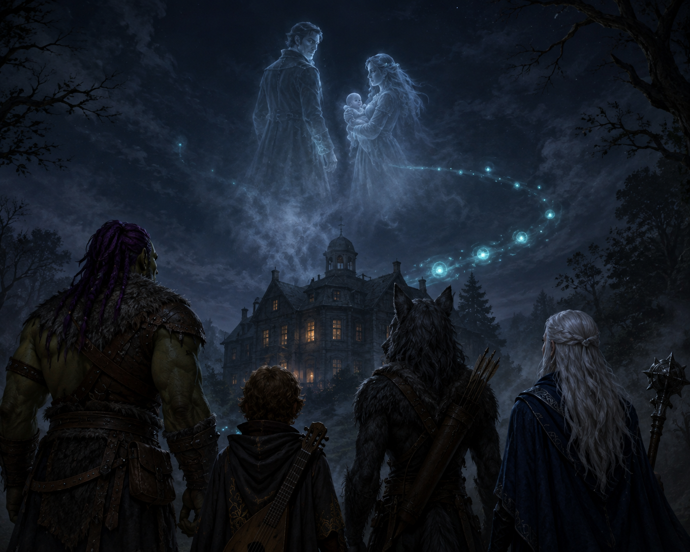

# The Battle of Crawford Manor

> *The mystery of Crawford had led Ravenlost to the manor. Getting inside was the easy part.*

---

## Entering the grounds

Crawford Manor loomed ahead of them.

After everything they had learned in the village, walking through the front gate seemed like a poor idea. Fortunately, Cadric found another way in: a section of fence they could slip through unnoticed. Jayn discovered something else: a cistern ran between the manor and the creek.

There was more beneath this place than they could see. For now, though, they crept onto the manor grounds.

---

## Inside Crawford Manor

As they walked the grounds, the first structure they noticed was a large observatory. Inside, Cadric could see pots containing small white flowers. 

Continuing along the grounds, they found a door leading to the manor’s basement. Cadric unlocked this. They entered a room that was packed with supplies. Chests lined the space alongside food, clothing, alcohol, and a ladder leading upward. One particularly large chest contained finer clothing—expensive once, perhaps, but decades out of fashion. Among the clothes were a raven-feather brooch and a silver necklace set with sapphires. Jayn pocketed both. 

Wondering if he was making good choices, Cadric extinguished the light and climbed the ladder. At the top, he quietly cracked open a door and peered through. Candlelight. And just as quickly, he came back down.

Bia went next. The door opened into what appeared to be a servants' kitchen. Somewhere above her, floorboards creaked. Footsteps. Cadric then relented and followed, finding himself in the kitchen.

Jayn slipped past them and began exploring the first floor. She found several rooms, including a greenhouse, though unlike the observatory, there were no white flowers growing there. 

Another room contained something far stranger. A dumbwaiter large enough to hold several people.

Jayn continued to the second floor. At the end of the hallway were two rooms—one behind a pair of double doors and another behind a single door. From behind the single door came the faint sound of crying.

Back in the basement, Elisandra had made a discovery of her own. A section of wall shifted backward when she pushed against it. She stepped through with her candle.

A body hung upside down from a hook. Blood dripped from the corpse—or what at first appeared to be a corpse. The man was older and human. His throat had been slashed, and his tongue was missing.

Elisandra moved farther into the darkness with her candle. There were more bodies. Five in all. All of the bodies had their tongues cut out. Most of the hanging victims had had their throats cut. But one had not. She also saw a shaft and chains for a dumbwaiter, along with a lever. 

Upstairs, Bia decided to join Jayn, who entered the room with the single door. Bia attempted to move quietly up the stairs. Attempted.

Her foot clipped one of the steps. There was a tremendous **THUMP** as Bia's large foot smashed straight through it. The footsteps above stopped. So much for stealth.

---

## "Fresh Meat"

A man appeared. Calling him large didn't quite do him justice. He was enormous, even compared to Bia. His arms were grotesquely huge and covered in dried blood.

He looked at her. 

"Fresh meat."

From below, outside the kitchen, Cadric looked up the stairs and saw Bia facing the massive figure. "Holy fuck." 

In the room at the end of the upstairs hall, Jayn saw an elderly female gnome crying beside an empty crib. She looked at Jayn and immediately motioned for her to be quiet. They whispered. 

Jayn explained that she and her companions were trying to save Crawford. Jayn suggested that the woman leave with them. The woman shook her head. They couldn't save it or her. She told Jayn to jump out the window and leave while she still could.

Her name was Thema, and she had served as caretaker of Crawford Manor for sixty-two years. The enormous creature stalking Bia on the stairs was what remained of Sterling Crawford. And Sterling was getting worse. His wife, **Ladna Crawford**, was gravely ill with anemia. As Ladna's condition had deteriorated, Sterling had grown larger and increasingly unstable.

Ladna's child still hadn't arrived. Thema wasn't certain it ever would. Thema herself was trapped inside the house. Jayn offered to help her escape through the window. This time, Thema agreed. Jayn lowered her down with her rope and then followed.

Meanwhile, Sterling attacked. He kicked Bia down the stairs, finally freeing her foot from the broken step. 

In the basement, Elisandra could hear the battle erupting overhead. She could even hear Cadric singing his attacks. She stayed with the man hanging from the hook. He was alive. Barely. Could she help him?

---

## Sterling Crawford

Sterling smashed through the banister and charged at Cadric. He swung, but Cadric's luck held. Sterling misjudged the halfling's height completely, his fist sailing over Cadric's head and smashing into the wall. His arm lodged there.

Cadric attacked. His blade barely scratched Sterling's flesh. So Cadric tried again, this time driving his dagger into Sterling's enormous arm and leaving it embedded there.

Bia saw her opening. She swung her axe and buried it deep into Sterling's trapped arm.

Downstairs, Elisandra pulled the dumbwaiter lever. 

Outside, Jayn ran to the front door and tried to pick the lock. Nothing. She decided to ring the doorbell and waited around the corner. No answer.

Inside, Sterling tore his arm free from the wall and kicked Cadric down the stairs. He moved to follow and strike again. But Bia struck as he tried to go down the stairs. Her axe tore critically across the back of Sterling's neck. The enormous man collapsed onto the landing, writhing in pain.

Cadric tried to finish him. And missed.

In the basement, Elisandra sprinkled holy water over the injured man on the hook. She couldn't lift him down alone. For now, keeping him alive was the best she could do.

Outside, Jayn saw Thema sprinting away from the manor. She tried the lock again. Still nothing. So she broke a window and re-entered the basement.

Back on the stairs, Sterling was struggling to his feet. He attacked Bia once and missed. He attacked again and missed again. He screamed, "I WILL NOT LET THEM TAKE HER!"

Bia swung. Her axe slammed into the wall. It was Cadric who landed the final blow.

Sterling Crawford fell.

Silence settled over the stairwell.

Cadric walked over to the enormous corpse, grabbed both of Sterling's arms, and began moving them like a puppet. He began chanting "Fresh meat!" and mimicking some of Sterling's other comments. Then he noticed the ring. Cadric cut off Sterling's finger and took it.

---

## Ladna Crawford

The dumbwaiter had reached the basement. Elisandra saw bloody footprints inside it. Jayne walked through the room filled with the hanging bodies and caught up with Elisandra. Together, they climbed into the dumbwaiter and rode it upstairs.

Eventually, the entire group gathered on the second floor inside the room with the double doors. 

A heavily pregnant woman lay on the bed. An IV ran from her body to a pulsing red sack filled with blood.

This was **Ladna Crawford**. Elisandra reached out to her telepathically. The response came immediately.

“Kill me. My existence is torture.”

Ladna told her that what she carried was no longer her child. “It's not a child of mine anymore.” But Sterling had kept her alive. Not simply because he couldn't bear to lose his wife. Ladna warned them about Wilfred Godfroy. He would come for them in death. Sterling had been keeping Ladna alive to prevent that from happening.

If the party killed her, Ladna explained, she would have fourteen hours—until midnight—to be herself again. Then she would be compelled to join the Hallowed March to the house on Griffin Hill. 

Cadric wanted no part of this. He looked around the room, found a hat and took it. He left the room and headed to the observatory for some hemlock, because you never know when you'll need a paralytic.

Bia had killed severely wounded animals on her farm in acts of mercy and never liked it. But it was Jayn who approached the bed. She leaned down and gently kissed Ladna on the forehead. Then she drove her weapon into Ladna's stomach.

The blade punched through one layer. Then another. Then another. At least three layers of bone. Ladna died. Fluid burst from her stomach. And from within emerged an unholy creature. It had many eyes. A tail. And it was dead.

For a moment, nobody spoke.

---

## The survivor

The group returned to the basement. Together, Bia and Elisandra managed to remove the surviving man from the hook.

Jayn investigated a tunnel leading from the basement toward the cistern. She crawled into it headfirst and followed it as far as she could. She found a shoe. Nothing else. So she crawled back.

Cadric used healing magic on the rescued man. He still couldn't speak—his tongue was gone—but the group suspected they knew who he was. Daverick.

Elisandra searched the room and found a chest containing the victims’ belongings. Jayn found a little extra compensation as well:

- 17 gold.
- 36 silver.
- 12 copper.

Elisandra found a bottle of grain whiskey. She drank the entire thing on the spot. Then they took Daverick outside.

---

## Crawford comes to the manor

Thema was there. So were the villagers. They were making their way toward Crawford Manor. When they saw Daverick alive, the mood changed immediately. The people of Crawford were overjoyed to have him back. 

Thom, the village priest, and Ron asked whether everything had been handled. The party told them what they had found in the basement. The bodies. The hooks. The missing tongues. Thema insisted she had known nothing about this, but the party wasn't entirely convinced.

The villagers entered the manor to see for themselves. One came back outside and vomited. There was blood everywhere. Crawford Manor had become a slaughterhouse.

Cadric offered one final piece of clarification. "Also, that guy was already missing a finger."

---

## Griffin Hill

There was nothing more to be done at the manor that night. The villagers returned to Crawford, and the party went with them. Thom arranged a room for Ravenlost at the inn.

The town was grieving. Too many people had died inside that house. But beneath the grief was relief. For the first time in recent months, the people of Crawford believed they were safe.

Cadric performed at the inn.

Jayn examined the jewelry she had taken from the manor. The raven-feather brooch wasn't magical. The sapphire necklace was another matter. There was something about it.

Cadric similarly examined his newly acquired cap and Sterling's ring.

But the party had one more thing to investigate. Ladna had told them what would happen at midnight, and they wanted to know if what she told them was true.

---

## The Hallowed March

At midnight, the party stepped outside and looked toward Crawford Manor. In the distance, a ripple of greenish-blue light shimmered through the darkness. Orbs drifted away from Sterling Manor and traveled toward it. 

Then the party saw them. Ghostly figures. Sterling Crawford—no longer enormous, no longer monstrous, human again. Beside him floated Ladna Crawford—she, too, had been restored to human form. And in her arms she carried a baby.

For a moment, the spectral family looked back toward the manor. Then they turned away. Together, Sterling, Ladna, and the child continued northeast. Toward Mordenshire. Toward Griffin Hill. Toward whatever awaited the dead there.
