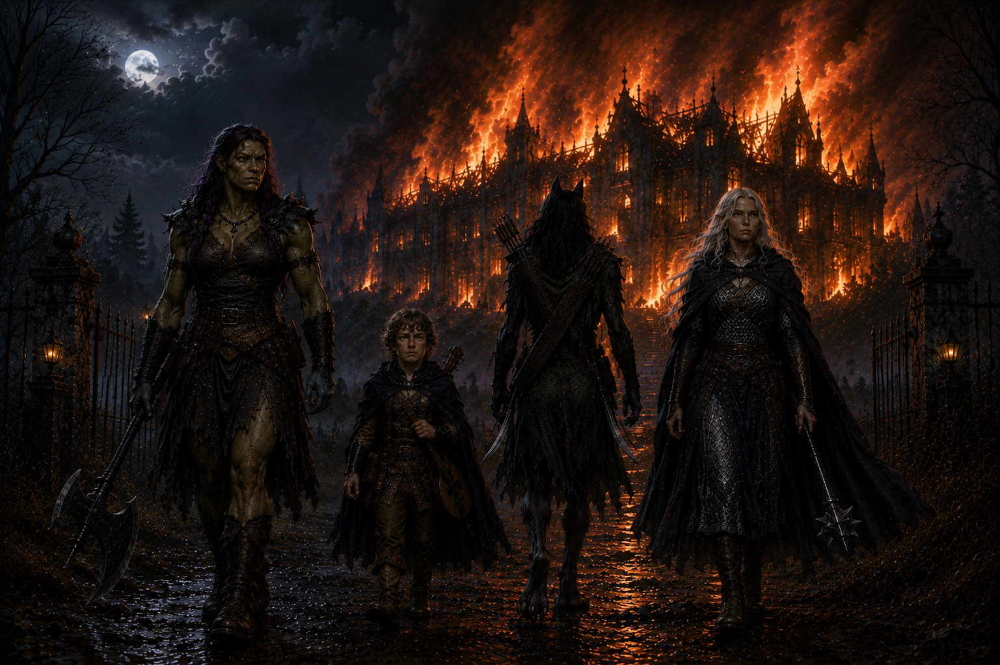

# Home is where the horrors are (Draft)

> *They gave the painting what she wanted. She should have asked for more.*

---

Lady Waterford wanted to go home. That was the problem.

Ravenlost had done what Farrow asked. They entered the abandoned ship and retrieved the portrait of Lady Waterford. They broke into the mausoleum and recovered Lord Waterford's jeweled walking stick. 

They could have returned to Farrow, collected their money, and moved on. But when Jain had taken the portrait, the woman inside it had spoken to her.

She wanted to go home.

And Jain wasn't about to hand her over until they knew what that meant.

## A DeLawrence Pouchenelle before she was a Waterford

Jain stayed behind in room 301 while Cadric was questioning Edgar, and Elisandra and Bia questioned Renee, the proprietor of the Globe Inn. 

They learned that the Lord Waterford and his wife had died sixty-four years earlier in a carriage accident while traveling toward Mordenshire for a gala at Godfroy's Manor. They learned that the old Waterford manor had burned years later, and the Waterford family had been gone from the town for decades.

But Lady Waterford hadn't always been a Waterford. Before her marriage, she had been a **DeLawrence Pouchenelle**. And her family had lived in **Idlethorp**.

There was another troubling question. Why wasn’t Lady Waterford buried in the Waterford mausoleum?

Edgar, the gravedigger, regularly checked the crypt and confirmed that there was a sealed coffin where Lady Waterford was supposed to rest. But he'd never opened it.

Ravenlost knew it was empty. Now they had even more questions.

---

## The ghost in room 301

Back in room 301, Jain received a visitor of her own.

A scarred man entered the room and appeared just as surprised to see Jain as she was to see him.

Before she could get much of an explanation, the man walked straight through the outer wall. 

Jain jumped over to the window and watched where he went.

Toward the docks.

Naturally, the Ravenlost would have to follow.

The rest of the team soon arrived back at room 301 and learned what Jain had seen. 

Now it was time to chase down a ghost. 

Bia stayed behind with the painting, in case the scarred man returned. The rest went toward the docks.

Their search led them into more of Waterford's secrets, including a concealed gathering place beneath the Globe Inn that the group quickly dubbed the **human speakeasy**.

It didn't explain the ghost. But at this point, unexplained ghosts barely qualified as unusual.

The more promising lead was Idlethorp.

If Lady Waterford wanted to go home, perhaps she meant the home she'd had before she became Lady Waterford.

So the Ravenlost packed up the portrait and headed out.

---

## Welcome to Idlethorp

Idlethorp was not particularly welcoming.

Red warning flags marked the approach, and a man on horseback, Dave, was responsible for warning travelers away.

He told them the town had been abandoned for about six weeks. There had been strange noises in the night. Shadowy creatures. Things moving where things shouldn't be moving.

Another group had gone into Idlethorp about a week earlier. Only one of them had come back.

Ravenlost decided that perhaps charging into the abandoned monster town in the middle of the night wasn't the best idea they'd ever had. They made camp on the ridge.

Then Bia had an idea. They had brought Lady Waterford all this way. Why not unwrap the portrait and see if she reacted?

Jain took hold of the wooden frame.

Something popped inside her head. Warmth spread through her. And suddenly the painting knew exactly where it needed to be. The enormous manor overlooking Idlethorp was **home**. Having no control over her movements, Jain took off running. With the portrait. Without explaining anything to anyone.

The rest of the Ravenlost watched dumbfounded for a moment before deciding to scramble after her. 

They caught up with her just inside Idlethorp. Jain was able to let go of the painting, but had no recollection of how she ended up away from their camp.

---

## The things in the streets

Idlethorp wasn't entirely abandoned, as Dave had told them.

Shapes emerged from the darkness, and the closer the Ravenlost looked, the worse they became. They were made from people. Or, at least, pieces of people.

Limbs joined where limbs didn't belong. Bodies stitched and rearranged into shapes that should never have existed. Human parts assembled with no apparent concern for what a human body was supposed to look like. And they were ready to attack.

Ravenlost fought back.

Jain fired her bow. Bia swung her axe. Then Cadric brought daylight to Idlethorp.

The effect was immediate. The creatures fled. Every one of them turned away from the magical daylight and retreated in the same direction.

Toward the manor.

Apparently, that was where everyone was going tonight.

---

## Home

The DeLawrence Pouchenelle manor had seen better days. Much better days.

Windows were shattered. Hallways were deteriorating. The remains of a once-grand home were slowly giving way to rot.

Jain, after having covered the portrait again, carried it to the manor and pressed it against the house.

"Is this the home you desire?"

Warm contentment washed through her.

Yes.

Not in words. But, still, yes.

As Jain carried the portrait inside, the feeling only grew stronger.

Lady Waterford was home. Now they just needed to survive it.

---

## Sister

Ravenlost continued through the manor. Jain began searching a room or a hall with a missing painting. The others treaded slower and more carefully. Still, as they went from room to room, Cadric, Elisandra, and Bia noticed that something enormous moved inside as well.

The humanoid that emerged from a nearby room stood more than eight feet tall. Its body was an assortment of mismatched flesh stitched together into the approximate shape of a man.

Two metal bolts protruded from its neck.

It attacked.

But Ravenlost tried something other than simply hacking it apart. Elisandra telepathically spoke to the creature of Lady Waterford. Of the DeLawrence Pouchenelle family. And their quest to bring her home.

For just a moment, something changed in the creature. Recognition!

Then just as suddenly, electricity crackled through the bolts in the creature's neck. Its body convulsed, and whatever memory had surfaced seemed to disappear beneath the force that controlled it.

The bolts were doing something to him. Elisandra suggested to the creature that the bolts were controlling him. The creature reached for the bolts.

He pulled. Electricity arced through his body as the first bolt came free. He struggled with the second, but was able to pull it out. Then he collapsed.

One final word escaped him.

"Sister."

And he died.

Dark red sludge, thick as molasses, seeped from his body.

For a creature that had looked like nothing more than another monster roaming Idlethorp, his final moment suggested something far worse. He had remembered someone.

---

## Meanwhile, Jain…

Jain's search brought her into what remained of the manor's grand ballroom. Most of the outer wall had been destroyed, and the center of the room was buried beneath wagons, crates, lumber, dead horses, and debris. She watched as one of the grotesque torso-like creatures wriggled into the pile and disappeared.

Normally, this would have been more than enough reason for Jain to investigate.

This time, she was alone.

Jain looked at the pile, looked at all of the hands, considered her options, then reconsidered her options, and walked right past the pile toward the fireplace mantel.

Somewhere in Mordent, good judgment briefly stirred from a long sleep. Briefly.

The mantel loomed before her. She discovered a pressure-activated hook above the fireplace mantel and climbed up to trigger it, revealing the secret passageway. Good judgement be damned. Jain went in.

---

## Don't disturb him

The manor continued giving up its secrets. Before heading farther upstairs, Ravenlost returned to the fountain in the grand entrance and took a closer look at the rusted clockwork ballerina. A small plaque at its base read, “For my friend of a like mind, happy birthday, **Glim Brightstone**.” Someone in this family had known Glim personally. 

Venturing upstairs, another room brought its own surprise. When Cadric picked a lock on a door, a swinging blade dropped from the ceiling, narrowly missing his head. The perks of being short.

Beyond that room waited another section of the house. And a warning.

"Don't disturb him while he's working."

That was rarely a promising sentence.

The room beyond was part library, part laboratory. And mostly nightmare.

A man stood over a small dwarf body, surgical tools in hand. Blood coated the work area.

This was **Leon DeLawrence Pouchenelle**. Lady Waterford's brother. But Leon and the dwarf weren’t the only creatures in the room. Nearby sat a brain. In a jar. A living brain. A very angry living brain.

---

## Ravenlost versus the brain

The brain attacked with psychic force. One blast struck Bia directly, pain exploding through her head. 

The laboratory erupted into battle as the Ravenlost fought Leon, the brain, and grotesque creations that came in and surrounded them.

The brain was clearly more than a specimen sitting on a shelf. Its power was tied to the horrors filling the manor. That made the solution fairly straightforward. 

Bia raised her axe. The blade crashed through the jar. Glass shattered. The brain burst apart. Whatever necrotic force had animated them was gone. Ravenlost had killed the brain. At the time, this seemed like an unquestionably good thing. But because this is Ravenlost, they would reconsider that later.

Throughout the room and the manor, the remaining flesh creatures collapsed. Just then, Jain rejoined them, emerging through a bookcase door that led from the secret fireplace passageway. 

Seeing the piles of dismembered body parts, Jain found more than enough hands to choose from. She picked up two and waved them wildly at Cadric, who noticed a ring fly off. He decided not to pursue the ring, calling it “the angel’s share.”

Meanwhile, Jain continued using the hands and gave Cadric a hug.

---

## Lady Waterford's place

With the immediate danger gone, and the gang back together, Ravenlost continued searching the manor.

Eventually, they found a wall filled with portraits. Generations of DeLawrence Pouchenelles stared back at them. And among them was an empty space.

Jain approached with Lady Waterford. The portrait fit perfectly. She placed it back on the wall beside the rest of the family.

The warmth Jain had felt since entering Idlethorp changed. It didn't disappear. It settled. The longing was gone. After decades away, Lady Waterford was exactly where she wanted to be. Home.

Of course, the Ravenlost still had no idea where her actual body was. One mystery at a time.

---

## The traditional method of potion identification

The manor's former inhabitants had accumulated quite a collection of potions and items. Among the spoils were a purple cloak with feathered shoulders, an unusual blue-gilded lute, magical boots, strange contact lenses, and an assortment of potions.

Cadric claimed the cloak and lute. Bia took the boots. Elisandra took the contacts.

Then came the potions.

Throughout Mordent, there are careful, scholarly methods for identifying unknown magical liquids. Jain chose a different approach. She tasted each. She experienced the effects of each. She determined that the potions were:

- A potion of growth
- A potion of giant strength
- A potion of fire breathing
- A potion of animal friendship
- A potion of resistance
- The scent of the mists

Ravenlost sorted out the collection.

Cadric received a potion of growth. Bia took a potion of giant strength. Elisandra received a potion of fire breathing. Jain kept potions of animal friendship and resistance, along with something called **Scent of the Mists**.

No one could accuse her research methods of lacking commitment.

---

## Leaving nothing behind

The portrait was home. The creatures were dead. The brain was splattered across the laboratory. Ravenlost had gathered everything useful they could find.

There was just one thing left to do. Jain set the manor on fire, and Ravenlost set back out of town, back toward Waterford.

Behind them, the DeLawrence Pouchenelle manor burned. 

For the first time in weeks, the road through Idlethorp was safe. Probably.

---

## Half a job, half the pay

Eventually, the Ravenlost returned to Farrow to collect their reward, but there was a slight problem.  

They had been hired to retrieve two objects. They had returned with neither (as far as Farrow knew).

Ravenlost informed Farrow that Lady Waterford's portrait was hanging exactly where it belonged - in Idlethorp.

After some negotiation, Farrow gave them **partial payment: 90 gold pieces each**.

Then he finally revealed the third job he'd been withholding. A client wanted an object of power retrieved. There wasn't much of a description: It was small enough to fit in the palm of a hand, and they would know it when they saw it.

Ravenlost was able to guess. A small object. Powerful. The sort of thing you would immediately recognize as unusual. Like, perhaps, a sentient brain in a jar. Like, perhaps, the sentient brain in a jar that Ravenlost had just destroyed.

This could become a problem. Perhaps Waterford was no longer the best place to spend their time.

---

## Candle Cross

Ravenlost decided to leave Waterford behind.

Their road toward Mordenshire now led toward **Candle Cross**, a hamlet built among the remains of a ruined castle beside the Arden River.

According to local stories, the old castle's drawbridge had a peculiar habit. It raised and lowered on its own. Some said it responded when evil threatened the town.

After Crawford, Waterford, and Idlethorp, a haunted drawbridge almost sounded reasonable. 

Almost.
