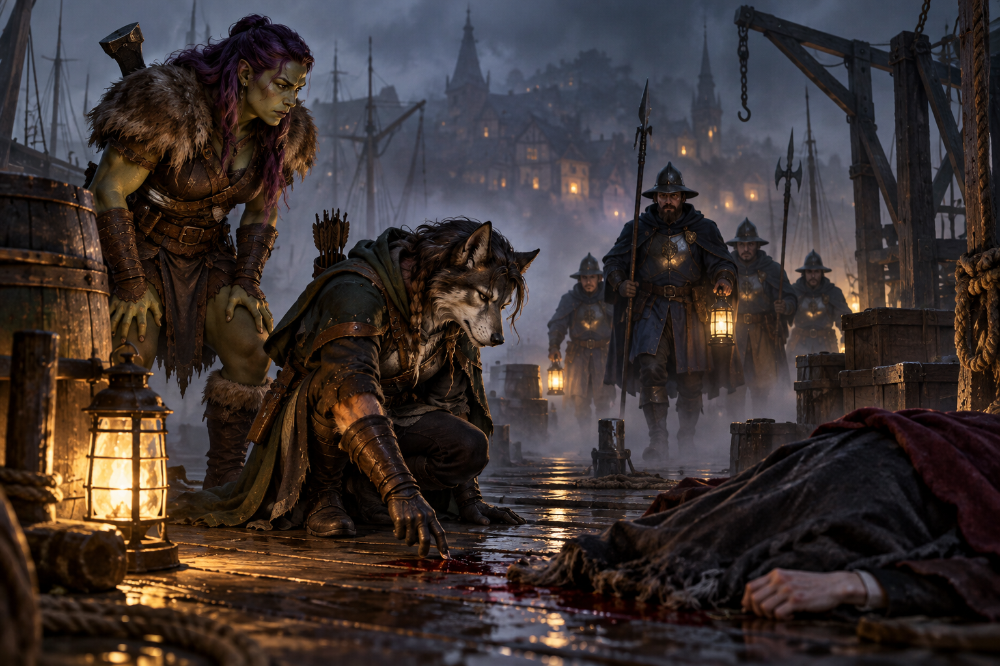

# "It wasn't me" in Mordenshire (Draft)

> *Ravenlost finally reached Mordenshire. Between a monster hunter, a
murder investigation, an undercover assignment, and a job from a dread
lord, they quickly found plenty of reasons to stay.*

---

The road north from Candle Cross finally brought Ravenlost to Mordenshire, a large coastal town built around a busy harbor. The party already had a reason for coming: Henry Loust had given them an invitation to the House on Griffin Hill, where Lord Godfroy was in need
of "mortal hands."

But Godfroy would have to wait.

Ravenlost had rooms to find, treasure to sell, and a certain herbalist to visit.

## Welcome to Mordenshire

A Halfling, an Orc, a Lupine, and a Kalashtar walk into Mordenshire.

It wasn't the beginning of a joke, although the four guards watching them enter town might have wondered otherwise.

Mordenshire was busy, with far more traffic than the smaller settlements Ravenlost had visited recently. The town had first appeared around a bend in the road, its buildings rising beyond the trees. Lupines and Orcs weren't exactly an everyday sight here, so Ravenlost attracted some attention as they approached the guards together and asked the most important question after a long journey: where could they find an inn?

There were three choices. The Blackcard sat in the center of town and catered largely to merchants; The Seventh Sea overlooked the coast; and the Salty Dog stood near Mordenshire's sanatorium, a facility filled with scholars.

Jain heard “sanatorium.” Her decision was made.

Jain and Elisandra headed for the Salty Dog, where under the false name “Jainisandra,” they rented Room 213 from an innkeeper named Menda. 

Bia and Cadric chose the Blackcard, which was conveniently located next to a bakery. An elderly Gnome innkeeper named Alenta sat behind the front desk with an old grimoire. They took Room 304, and Cadric arranged to perform at the inn from eight until nine that evening in exchange for their room and board.

---

## Different names and strange magic 

The party had a considerable amount of treasure left from Waterford to turn into something more useful: gold. It was time to sell.

Bia and Cadric went to the Salty Dog to meet up with Jain and Elisandra, only to discover that their companions hadn't exactly checked in under their own names. Menda, the innkeeper, knew them by different ones.

Apparently Ravenlost had been in Mordenshire for only a few hours and was already having trouble keeping its identities straight. 

They handed a letter to the innkeeper and asked her to give it to any guest that resembled a Lupine and a Kalashtar, and then waited at the bar for their companions to emerge. It didn’t take long. Jain and Elisandra attempted to discreetly exit through a second-story window, only to be seen by Cadric, Bia, and everyone else in the bar.

This was one way for Ravenlost to introduce themselves to Mordenshire.

Together again, the reunion gave the party a chance to examine some of the magical items they'd been carrying. Elisandra tried on a crown meant for a cleric that required attunement. As soon as she put it on, Bia and Jain saw the vague shape of a skeletal hand appear above her shoulder. Then it vanished.

Jain also examined the mysterious stone she'd been carrying and discovered that it was one of a pair of **Sending Stones**. Once per day, she could use it to communicate with whoever possessed its mate.

Naturally, Jain tried it. No one answered.

Elisandra also returned Jain's **Necklace of Disguise**, putting one more useful item back in Jain's hands.

---

## To market, to market

With rooms secured, identities thoroughly muddled, and at least one mysterious magical correspondent refusing to answer, Ravenlost headed out to see what else Mordenshire had to offer.

At Pyrite's Booty, they sold their accumulated bounty, including Lord Waterford's jeweled walking stick, for 4,000 gold. Thankfully, the owner didn’t ask too many questions.

At Hammerbarn’s Blacksmoth, Bia sold her extra greataxe for 27 gold. Jain left her shortsword to be imbued with silver, a process that would take a week. Cadric considered doing the same, but the blacksmith could only work on one weapon at a time. His sword wouldn't be finished until a week after Jain's, so Cadric decided to keep it.

At Atom's Arcana, the party found plenty of magical items they couldn't afford.

Cadric found one he could. He purchased an Eversmoking Bottle for 950 gold.

Then Ravenlost went to visit Rudolph Van Richten, the herbalist that Jennifer and Lori recommended they go see when they got to Mordenshire.

---

## Something in the herbalist shop

Ravenlost arrived at Van Richten's Herbalist and found Beatrice, one of Rudolph Van Richten's employees, wounded outside.

She had arrived early that afternoon to open the shop and had been attacked by something inside.

Elisandra went in to investigate. Whatever had attacked Beatrice was still there.

A shadowy black panther attacked Elisandra and knocked her unconscious. After the others revived her, Elisandra remained outside with Beatrice while Bia, Cadric, and Jain entered the shop.

Inside, they found blood on the floor and signs that something strange had happened. The panther appeared again, attacking and missing before disappearing farther into the building. Another small, wiry shadowy creature tossed a flask at Jain, hitting her in the back of the head before smirking and then disappearing.

Jain headed upstairs, where an unseen force on the steps tried unsuccessfully to stop her. Bia followed. Cadric reluctantly also went along. Knowing that he was unlikely to push passed the unseen force, Bia pulled him up with her rope. 

Upstairs, Van Richten's living quarters contained research on the different domains of Ravenloft. Jain found *Van Richten's Guide to Ravenloft* and a scroll. On a nearby desk, she also discovered a strange mummified cat covered in markings and broke into two pieces. Jain naturally picked it up. She tried to connect the pieces, but was unsuccessful at making the mummy whole again

Then Jain entered the master bedroom. A man stood frozen in mid-step, holding the remains of a burned-out candle. His eyes were open. And they moved.

Rudolph Van Richten was still conscious.

Through a series of questions and Rudolph making left and right eye movements, the party determined that the scroll they had found could help him. Cadric read it aloud. The scroll contained **Protection from Evil and Good**.

Rudolph Van Richten could move again.

Unfortunately, freeing him wasn't the same thing as solving the problem.

---

## The mummified cat

Van Richten explained that the mummified cat needed to be taken into his basement, where he could perform a ritual to contain whatever had been released from it. 

The basement contained a full ritual chamber, as basements do.

Van Richten placed the mummy in the center of a magical circle. He warned Ravenlost that once he began chanting, he would have to concentrate on the ritual. Defending him would be their job.

As Van Richten chanted, shadows began gathering above the mummy. They slowly coalesced into the form of the enormous panther.

The creature attacked.

Ravenlost fought while Van Richten continued the ritual. Cadric was eventually knocked unconscious, but the party kept the creature from stopping Van Richten. 

Finally, the shadow panther dissipated. Its shadows flowed back into the mummified cat, whose damaged body fused itself back together.

Van Richten stopped chanting and took a breath.

"So we're good?"

Jain looked at Cadric, still unconscious. "I think we're good."

Bia was able to get Cadric up and functional. The group walked upstairs, stopping outside the door to check on Elisadra.

Then he offered everyone to stay for tea. After the afternoon they'd had, tea sounded excellent.

---

## What Van Richten knew

Ravenlost had questions. Van Richten had answers. Or, at least, more answers than most people they'd met.

He knew quite a bit about Lord Godfroy. Godfroy controlled ghosts who had died after him, although those ghosts apparently had considerable freedom in how they interpreted his commands. Henry Loust was the Godfroys' head butler in life and was likely subject to that control. Lady Estella Godfroy opposed Godfroy but remained trapped at Griffin Hill after one of his experiments killed her.

Godfroy's ghosts could also move through walls and observe people without being seen. That made the upcoming meeting at Griffin Hill considerably less appealing.

Jain also told Van Richten a version of what had happened to her in the Mists outside Candle Cross. He believed the creature Jain had encountered may have been a **Mist Horror**, an incorporeal predator that uses fear to lure its victims and could take on forms meaningful to them.

He explained more about traveling through the Mists. Talismans associated with particular domains could help travelers reach those domains. A Mist Wanderer could eventually find a route to a named destination, although that didn’t mean the journey would be safe or direct.

Jain was a Mist Wanderer.

The party also described the strange machine beneath Candle Cross. This caught Van Richten's attention.

He thought the device might be connected to **Glim Brightstone**. More specifically, it might have contained a **Glim battery**.

Ravenlost had seen Glim's technology before. The laboratory near the Black Lantern Inn contained damaged machinery, possible batteries, and Sedgwick, the automaton they had left behind.

Suddenly, that laboratory seemed considerably more important.

Van Richten had also heard rumors about the apparatus Lord Godfroy was seeking. Depending on which stories were true, the apparatus might allow someone to travel safely through the Mists. 

Others believe the apparatus might be capable of removing a soul from one body and placing it into another.

Or it might be capable of doing something similar on a much larger scale.

None of those possibilities made Ravenlost more eager to help Godfroy.

Before they left, Van Richten gave the party several things that might help: a **Lantern of Reveal**, a **Stone of Good Luck**, six vials of holy water, four wooden stakes, and a Tarokka deck.

He also agreed to make silver canine caps for Jain. They would be ready in approximately two or three days.

---

## **The breath of the dead**

That evening, Cadric performed at the Blackcard. His original song was met with mild applause. But when he brought out the old standby favorites, the entire bar erupted. He earned a nice bit of coin and agreed to play again the next night.

Among those in the crowd watching the performance was Henry Loust. More specifically, he watched each member of Ravenlost from a nearby table, a full pint of ale in front of him. Jain noticed him first and sat down at a chair beside him. 

“Jain.”

“Henry.”

That was all that was said until the end of the set, when Henry made it clear that Lord Godfroy already knew the party was in Mordenshire and suggested that Ravenlost make time for him.

Bia went outside for some air and noticed a fog rolling into town. It grew thick enough to swallow streets and buildings. Back inside the bar, she asked about it. The locals had a name for it.

**The breath of the dead.**

“Uhh, come again?”

Elisandra, still injured and needing a full night’s rest, pondered whether it would be better to stay at the Blackard, but decided she might be able to make it back to The Salty Dog. 

She and Jain walked out the door. Jain noticed a light flickering somewhere out in the fog. Whatever it was, it remained unidentified. 

Then Jain smelled blood.

“Nope”

Elisandra quickly returned to the Blackcard. Bia then joined Jain, and the two followed the smell toward the docks.

They found a body.

It was **Madeline**, one of the Blackcard's barmaids who had been serving them that night. Her throat had been slit. Her tongue was missing. A chunk of hair had been torn from the back of her head, and blood and skin were trapped beneath her fingernails.

Madeline had fought back.

The wounds were clean, and it appeared that her attacker had grabbed her from behind. 

Jain noticed a trail of blood that led away from the docks toward the sanatorium before disappearing into the grass.

Bia ran to the Salty Dog for help and then to the garrison in the center of town.

When she returned with the guards, Jain was gone.

Of course she was.

---

## **Jain investigates**

Jain had followed the trail of blood, never missing an opportunity to get close to a sanatorium.

A guard there told her that he had recently heard something moving in the bushes.

Jain decided that was probably the murderer. She announced that she was going into the bushes to investigate.

Two more sanatorium guards eventually joined her. Together they searched the area and found footprints leading from pavement up to the grass, where the tracks disappeared. But Jain found something considerably more useful. A bloody dagger, about six inches long.

The guards decided they could handle the investigation from there and ordered Jain back to the docks.

Jain disagreed with their assessment of their own competence.

“You guys kind of fucking suck, no offense, but this is what I'm good at. Can you let me do this?"

"You don’t work for the city of Mordenshire."

"Do I need to work for the city to avenge someone's death?"

Apparently, yes.

Jain was sent back to the docks.

---

## "You understand how you look, right?"

By the time Jain returned, several guards were gathered around Madeline's body with Bia nearby.

One asked Jain to explain what had happened.

Jain provided a concise summary.

"Smell blood, body dark, body dead, blood, blood trail, follow blood trail, find weapon."

The guards were particularly interested in that last part.

Jain had arrived in Mordenshire the day before. She had discovered a murder victim. She had followed the evidence away from the scene without waiting for the guards. She had announced to a sanatorium guard that she was going into the bushes.

Then she had been found in those bushes near a bloody murder weapon.

It was late, and the guards were confused. Jain agreed to answer questions the next day.

The next morning, Bia woke early and met Cadric and Elisandra at the bakery. She asked a sleeping Jain several times whether she wanted any pastries, but Jain only grumbled. She still needed more sleep, and a loud morning-Orc wasn’t helping.

Jain could finally sleep again after Bia left.

Rest was short-lived. Soon after, two guards arrived, knocking at her door.

“Ugh! It’s unlocked.”

The guards requested that Jain follow her to the garrison, where they could question her some more.

“Am I under arrest?”

“No. The captain just wants to talk to you.”

“Ugh! Okay.”

So Jain and two guards walked together through town and to the garrison. They escorted her into an interrogation room with one window, and left her there until **Captain Kilm O'Connell** arrived.

Jain tried pleading her innocence again.

"Let me tell my story, please."

She explained that she and a friend had found Madeline. Bia had gone for help. Jain had investigated the scene because that was what she did.

She had a nose. She had ears. She had found a blood trail.

The trail led toward the sanatorium, where a guard told her he had heard something in the bushes.

"Well, fuck, that's the murderer."

So Jain told the guard exactly where she was going.

"Wouldn't it be more weird if I just ran into the bushes without saying anything?"

She had then found the murder weapon.

"I played a critical role in this case."

O'Connell looked at her. "You understand how you look, right?"

Jain did.

She was a Lupine in a mostly human town. She was new. She had arrived immediately before a murder and then behaved in a way that, when described aloud, sounded remarkably suspicious.

"I didn't do it."

Fortunately, O'Connell already knew that. Madeline was, in fact, the town’s **fourth** victim.

"Oh, do you know it wasn't me then?"

“Yes.”

That was another reason, though she still looked "suspicious as shit."

But Captain O'Connell wasn't just interested in questioning Jain. He had a job for Ravenlost.

---

## Undercover

The murders weren't the only reason O'Connell was concerned about the sanatorium.

The facility kept largely to itself, and the town had very little oversight of what happened inside. The captain needed outsiders who could investigate without being connected to the Mordenshire government.

He needed two patients, a janitor, and a groundskeeper.

To no one’s surprise, Jain immediately volunteered to be a patient. And O'Connell made it clear that Jain's participation as a patient was not really up for debate.

Ravenlost later met with Mordenshire's mayor, **Alice Heatherman,** the mother of Jennifer and Lori. Together with Captain O’Connell, they discussed the operation. 

The sanatorium was controlled by **Dr. Caroline Resdonna**, who brought in outside researchers and staff while largely avoiding town oversight. The party's assignment was to determine what was happening inside and, if possible, whether the sanatorium was connected to the murders.

Their covers were quickly settled.

Jain and Elisandra would enter as patients. Bia would be a janitor. Cadric would be a groundskeeper.

The operation would begin in **three days**, when the janitor’s and groundskeeper’s papers would be ready.

Before then, Ravenlost still had business elsewhere.

---

## The EC Light

Mordenshire had also given Cadric and Elisandra an idea. A useful one, for once. And now that most of their errands and tasks were done in town, they could focus on their invention.

They had designed a reusable magical light using a copper outer tube, a silver inner component enchanted with *Continual Flame*, and a removable cap that could cover the light when it wasn't needed.

They called it the **EC Light**. They brought their idea to Hammerbarn’s and commissioned two: one for Elisandra and one for Cadric. He said the metalwork for the lights would be finished within a week.

Ravenlost then went to the tannery, where Cadric ordered a custom utility belt with a holster for the light along with a special pouch for his Eversmoking Bottle. The pouch would allow smoke to escape while keeping the bottle secured to his belt.

Elisandra also requested a utility belt for her light.

The leatherwork would take about three days. 

And that was it. With no other errands to run in town, and with about 8 hours before Cadric’s next gig, there was only one place left to go.

---

## **The House on Griffin Hill**

The House on Griffin Hill stood just outside Mordenshire behind tall wrought-iron gates. The gates were locked, with no sign of any guards. Bia announced out loud that Henry Loust had invited them. 

That was enough. The gates opened.

Inside, the grounds were immaculate. Hedges and elaborate topiaries stretched across the estate. As they walked up toward the manor, every so often, someone appeared to be tending the gardens just at the edge of the party's vision. Whenever anyone turned to look directly at the worker, no one was there.

Cadric took notes. He was going to be a groundskeeper soon. Ghost gardening might be useful.

The party also noticed a huge area of recently disturbed and compacted earth on the property.

Henry greeted them at the manor and mentioned that they’re undergoing an expansion of the manor. He then led them to a sitting room to wait for Lord Godfroy.

Cadric found a piano. Of course he played it. Elisandra, on the other hand, investigated.

The room was strangely dusty compared with the immaculate grounds outside. Elisandra found a leather-bound journal connected to Glim - the only journal in the bookcase that wasn’t coated in dust. On a nearby table was a decanted bottle that resembled possibly brandy, or what once was brandy. The bottle was sticky, and the cap stuck a little when Jain opened it. Pure alcohol.

Then Jain heard a metallic scraping or digging sound beneath the floor, while Cadric could feel vibrations through it.

Something was happening beneath Griffin Hill.

Before they could learn what, Lord Godfroy arrived.

---

## Capable mortal hands

Godfroy told them that he needed "capable mortal hands." Specifically, Ravenlost's.

He wanted the party to investigate **Glim Brightstone** and locate a more powerful version of the Glim battery.

He had three leads.

The first was **Welkspring House on Echo Island**, where one of Glim's friends had written that there was a safe haven. Strange blue writing at the house apparently prevented ghosts from entering.

The second was the **Cauldron of Tepist**. Its fountains were associated with resurrection, and Godfroy believed they may have inspired part of Glim's apparatus.

The third was in **Falkovnia**, where Ravenlost was to find **Mikhail Hatsamamous**. Mikhail had established a hospital near a mountain to help people suffering from the region's undead affliction. He might know where Glim had gone or what Glim had been working on.

Ravenlost was expected to investigate all three leads. Most importantly, Godfroy wanted the larger battery.

Traveling through the Mists into multiple domains wasn't a small request. Ravenlost negotiated accordingly.

Godfroy agreed to pay **15,000 gold to each member of the party** when the job was complete.

But they would have to leave in **one week**.

One week should give Ravenlost time to finish their immediate business in Mordenshire, investigate the sanatorium, and collect most of the equipment they had commissioned.

But there was still the matter of Cadric's sword.

His nonmagical weapon wouldn't be useful against ghosts, and he had chosen not to leave it at Hammerbarn for silver imbuing. It wouldn’t be ready in time anyway.

Godfroy agreed to lend him a **+1 shortsword**. 

Hooray, a magical item from a dread lord. Something no one really wanted.

Henry then escorted the party from the manor while he fetched the sword. A few minutes later, he returned with a beautiful sword and scabbard.

"Best of luck to you."

As if they didn’t know they needed it.

Later, Cadric examined the sword more carefully. 

It wasn't cursed. That was the good news.

The less comforting discovery was that Godfroy could use the sword to **scry on Cadric**.

Even Godfroy's gifts came with strings attached.

---

## Three days and one week

Ravenlost now had two deadlines.

In three days, Jain and Elisandra would enter Mordenshire's sanatorium as patients while Bia and Cadric infiltrated it as employees.

In one week, the party was expected to leave Mordenshire and begin Godfroy's search for Glim Brightstone's battery.

Four people had been murdered in Mordenshire, their tongues removed.

Something was happening beneath Griffin Hill.

The strange light Jain had seen moving through the fog remained unexplained.

Sedgwick was still somewhere in Glim's old laboratory.

And Ravenlost still didn't know what Lord Godfroy intended to do if they actually brought him the apparatus he wanted.

But at least they were getting paid.

And Ravenlost had reached **level 4**.
