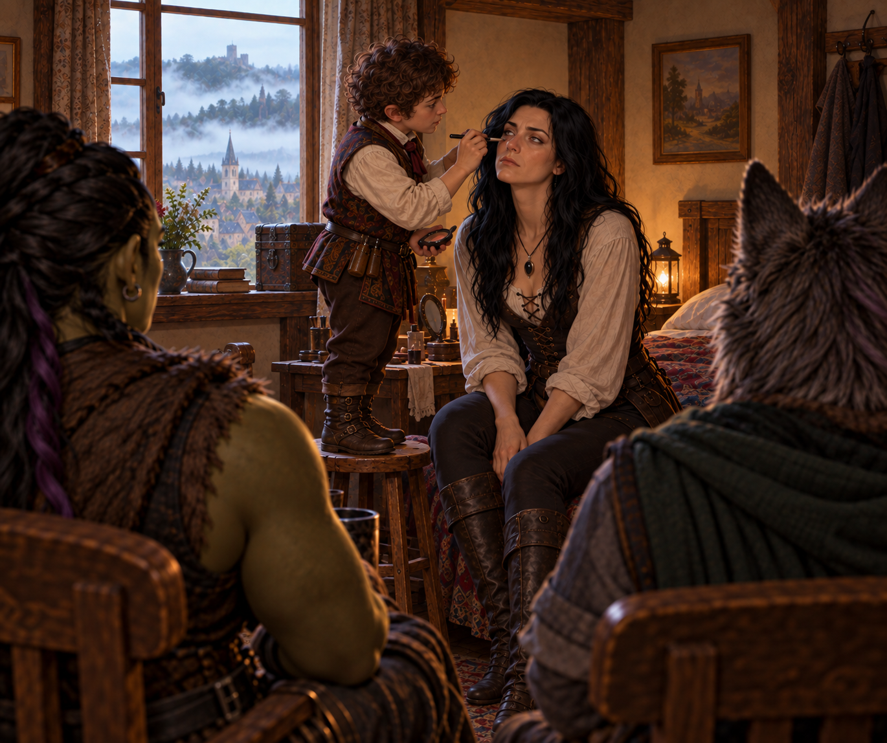

# The Child of Iron

> *Ten years after Elisandra fled Candle Cross, the Child of Iron came home.*

---

The road north was supposed to take Ravenlost through Candle Cross on their way to Mordenshire. Instead, the party found themselves trapped inside a walled town that worshipped one of their own, surrounded by impossible mist and confronting a secret buried beneath the keep.

By the time they left, Candle Cross had lost a rather large glass orb, its vicar, and its god.

## On the road again

Farrow had his painting. He didn’t have his walking stick.

Considering that Ravenlost had completed only part of the work he had given them—and had burned down the manor in the process—it seemed like a reasonable time to leave Waterford.

The road north led toward Mordenshire, with Candle Cross about two hours away. Beyond Mordenshire lay Abbey Point, where Glyn had reportedly gone with the mysterious draft. Their goal was still to track him down.

Before they got far, they encountered a man with a damaged wagon. The party stopped to help, and the man identified himself as Cooper. Cooper was heading south to Waterford with his wagonload of empty barrels.

Bia assisted with a wagon fix that would hold him until he reached Waterford. And Cadric entrusted Cooper with two copper pieces for Farrow.

"For our troubles."

It wasn’t much compensation for a burned-down manor, but it was something. (But really, was it?)

A storm was approaching from the north, and the parties agreed to part ways quickly. 

As the weather worsened, Ravenlost continued north, toward the storm. Eventually the road climbed a hill, giving them their first view of Candle Cross - and, more importantly, shelter.

The town sat behind thick walls, protected by a moat and drawbridge. A keep dominated one side of the settlement. Farmland stretched outside the walls.

And above it all, the sky was turning black.

---

## The Child of Iron

While still outside Candle Cross, and to the surprise of her fellow travelers, Elisandra used her necklace to disguise herself. She changed her hair to black and gave herself a crooked nose. 

And once inside Candle Cross, it didn’t take long for Ravenlost to discover that Elisandra had neglected to mention something. In the center of town stood a statue nearly thirty feet tall. It depicted a young woman. A young woman who looked remarkably like Elisandra.

An iron crown rested on the statue's head, and an iron throne sat beneath it. As townspeople passed, they acknowledged the figure. Some prayed.

Ravenlost looked at Elisandra.

Elisandra had some explaining to do.

She quietly mentioned that ten years earlier, at eighteen, Elisandra had fled Candle Cross. Before that, the people here had known her as the **Child of Iron**. They believed she protected them. They still believed she protected them.

For ten years, the town had continued to worship a woman who wanted nothing to do with being worshipped, simply because she didn’t have a known father. 

Among the people Elisandra remembered from her old life was Adelaid, her childhood friend, companion, and—depending on how one chose to describe it—something more complicated. Adelaid had helped Elisandra understand that what was happening to her in Candle Cross wasn’t normal.

She had also helped her escape.

For the moment, however, Ravenlost needed somewhere dry to sleep.

---

## Butterfly

At the inn, Cadric did what Cadric did best.

He played.

For about an hour, the halfling bard performed **"Butterfly"** and a host of other songs on his lute, earning a respectable collection of coins before settling in to talk with Florence, the innkeeper.

It should have been an ordinary night. But the drawbridge was up.

And by morning, Candle Cross was surrounded by the Mists.

---

## No way out

The Mists weren’t unusual in these lands. This Mist was.

Instead of marking a distant boundary between domains, it had formed directly around Candle Cross, stopping beyond the moat and completely enclosing the town. The people of Candle Cross had never seen anything like it.

At the daily dawn sermon, the town's priest offered reassurance.

“The Child of Iron would protect them.”

For Ravenlost, that answer was insufficient. Bia stayed with Elisandra, who was back in her actual form. 

Jain and Cadric went to the wall to investigate the Mists for themselves by jumping over the wall and into the Mists.

Naturally, they introduced themselves to the guard in a typical Ravenlost way.

Jain introduced herself as **Pupert**.

Cadric introduced himself as **Mr. Meeples**.

The guard introduced himself as Pubert. Seeing a Lupine and a halfling tied together, about to go over the wall wasn’t something Pubert expected to see that morning. He begged them not to jump.

When Pupert and Mr. Meeples explained that they wanted to just examine the Mists, Pubert obligingly looked away.

---

## "I found you"

Jain tied the rope around herself, around Cadric, and attached it to the wall. Before jumping over, she attached Cadric to a “baby Bjorn-Cadric” on her chest. Together, they went over the wall.

In the Mists, someone called to Jain. Jain saw a battered female Lupine.

"I found you."

Jain ran and followed the Lupine.

The farther she went, the stranger the Mists became. It disoriented her, pulled at her mind and showed her things she couldn’t explain.

Cadric saw something too, but not the Lupine that Jain was following.

Cadric saw a Jain who wasn’t quite Jain. It was Jain with a silver eye.

Cadric hollered and managed to persuade Jain to turn around, and the two made it back over the wall.

That should have been enough experimentation with the supernatural Mists.

But this is Ravenlost, so it wasn’t.

Jain was determined to go in again. This time, Cadric stayed behind with Elisandra, and Bia accompanied Jain. Rather than jumping and walking into the Mists. Bia slowly lowered Jain down until she was just barely inside.

Jain again saw the figure, closer this time, with gaping wounds. It again said, “I found you.”

When Bia felt a strong pull on the rope 30 feet below, she quickly pulled Jain back up.

Jain had hit her head on the way up and came back slightly injured. 

But for Jain, the third time was a charm.

Bia lowered her down again. This time, the figure appeared directly in front of Jain and again said, “I found you.”

Bia again felt a tug and pulled up on the rope. This time, a nearly lifeless body of Jain came back. Bia grabbed her and brought her to Elisandra, who put Jain back together—somewhat. 

In the end, the Mists had provided few answers, but one conclusion was becoming difficult to argue with. Going into it was a terrible idea.

They needed another way out of town. And they needed to know why the Mists were there.

---

## A couple of old friends, and maybe a new one

The party agreed that the keep was the best place to find answers. Elisandra provided a map. Its large meeting room was open to everyone, which meant they could start by simply walking through the front door. 

Almost everyone.

Elisandra had already lost her disguise, and walking into the center of a religion devoted to the Child of Iron seemed like a bad idea. Cadric applied makeup and disguised her again, but Elisandra still refused to enter the keep.

She would stay outside and keep watch, and Jain stayed with her.

Bia and Cadric went inside. Their plan was simple: ask to speak with Vicar Kellan and see what they could learn about the Mists.

Inside, they met **Elder Pubert**, one of Candle Cross's priests and, given the uncommon name, likely the father of the guard Jain, Cadric, and Bia had encountered on the wall. Elder Pubert seemed genuinely willing to help, although he had few answers about the Mists.

Then Bia and Cadric encountered someone they hadn't expected to see in Candle Cross.

**Henry Loust.**

Henry was at the keep for a meeting with the Vicar. Bia and Cadric spoke with him briefly and learned that he was still interested in their search for Glyn and the mysterious draft. 

Outside, another familiar face appeared.

A red-haired woman hurried past the keep.

Elisandra recognized her.

**Adelaid.**

Ten years had passed since Adelaid helped Elisandra escape Candle Cross. Jain followed her and caught up with her away from the keep.

Adelaid knew something was wrong.

About three weeks earlier, she had seen a large glass object—roughly five feet across—being transported into the keep. Since then, things had changed in Candle Cross. The drawbridge went up every night. Strange fog appeared in the distance. And Vicar Kellan and the elders had grown increasingly secretive.

Now the fog had become a wall of mist around the entire town.

Whatever had been brought into the keep seemed like a good place to start.

---

## Meeting the Vicar

Back inside, Bia and Cadric were still waiting to speak with Vicar Kellan.

Henry left for his own meeting with the Vicar. That presented a new problem.

Henry knew Ravenlost was traveling with a woman who looked remarkably like the Child of Iron. And now he had just met privately with the leader of the religion devoted to her.

But that was a problem for another time. Right now, they still wanted answers about The Mists.

Eventually, Bia and Cadric got their meeting with Kellan. The Vicar described the Mists as a test of faith. He offered reassurance instead of explanations and instead asked them to accompany him elsewhere.

“Come with me.”

They refused.

He tried to persuade them, but they repeatedly refused. So he locked them in the library.

Outside, Jain and Elisandra continued watching the keep. They saw robed men moving through the building and heard instructions to guard the doors.

Ravenlost had tried talking. It was now time for a different approach.

Elisandra cast telepathy and communicated with Bia. She told Bia about the sphere, and that she, Jain, and Adelaid would search the basement.

Bia mentioned her and Cadric’s predicament. If they could escape, they would check the roof.

Elisandra cast **Silence**.

Cadric picked the lock that led to the staircase. Outside the door, moving in silence, they encountered a guard near the stairway, sitting lazily on a chair. Not knowing him or how much he was getting paid for this work, they knocked him unconscious rather than killing him. Cadric then took the guard’s only valuable possession—an iron crown.

Then they went upstairs.

---

## Beneath the keep

Meanwhile, Jain and Adelaid made their way to the basement of the keep. A fountain in the basement concealed a passage leading into a cavern illuminated by eerie purple light.

Six figures waited inside.

At first, they didn’t react to Jain.

Then Jain noticed that none of them were breathing.

Their feet were bound. Iron crowns had been seared into their bodies. Around them were other remains in varying stages of decomposition. Deeper in the chamber stood an altar covered with the accumulated wax of countless candles. Upon the altar sat a human skull. And the skull wore another iron crown.

Elisandra entered the cavern shortly after Adelaid and Jain.

The figures stirred.

“The savior had returned.”

Jain being Jain reached out and touched the iron crown on the skull.

Nothing happened.

Considering the circumstances, that was probably the preferable outcome.

---

## A museum for someone who wasn't dead

The mysterious glass sphere wasn’t in the basement.

Bia and Cadric were on the second floor, where they found something almost as unsettling as the cavern below.

Elisandra's room was still there. And it had been preserved. 

For ten years, Candle Cross had maintained the childhood room of its missing savior like a museum exhibit.

Elsewhere, Cadric searched Vicar Kellan's room. The lock was trapped. Cadric discovered this fact by taking a small dose of poison after successfully picking the lock.

Cadric searched the room and found an iron crown. 

The party also began accumulating iron crowns. Elisandra had already taken the one from the iron throne beneath her statue.

So many crowns. No explanations.

---

## The orb

Bia went to the roof.

There she found what Adelaid had described.

A glass orb roughly five feet across stood beneath the dark sky, surrounded by two metal bands that could rotate around it. Nearby was a control panel containing a lever, colored buttons and a slot for a power source.

The construction looked disturbingly familiar.

Ravenlost had seen technology like this before. In Glyn's laboratory.

Cadric joined Bia and began experimenting with the controls. 

He pulled the lever. The metal bands began moving.

He pressed the red button, because that’s the one everyone knows to press.

Outside the keep, the Mists moved.

It flowed toward Candle Cross, across the surrounding land and toward the orb. Then it poured inside. 

Within the captured Mists were shapes.

Gnashing teeth. A shadowy eye. And was that a goblin head?

And suddenly Candle Cross could see beyond its walls again. Unfortunately, the townspeople could also see the keep.

They had already heard from the Vicar that the Child of Iron had returned (thanks for nothing, Henry), and they were coming for their savior.

---

## The Child of Iron returns

Cadric had an idea.

Using **Disguise Self**, he transformed into the closest approximation he could manage of Elisandra.

Not the six-foot-tall Elisandra standing nearby. Cadric was only three feet tall, and there were limits to this magic.

So Candle Cross received the miraculous return of its savior in the form of an approximately fourteen-year-old Child of Iron.

Bia helped sell it. While he disguised himself, she ran back to Elisandra’s bedroom and found some clothing that looked like it might fit Cadric’s new form. Might as well make this look authentic.

It was nighttime. Bia could lower the Cadric-Elisandra form down on a rope for all the townspeople to see.

From his rope, Cadric exclaimed to the crowd below. **“Lo! I return to you, your Child of Iron. I have freed you from the danger of the Mists. Your Vicar and his elders lie to you. They are not your friends. They must be stopped.”**

From atop the roof, Bia continued to try to sell the story.

**“The Vicar brought the Mists. And the Child of Iron pushed it back.**

It worked. The people listened. And more importantly, they believed.

The crowd turned on Vicar Kellan.

Some wanted him dead.

Bia and Cadric didn’t. At least, not without consulting Elisandra first. And not without some answers. 

---

## Four to six seconds

Ravenlost still had a glass sphere full of nightmare mist sitting on the roof. 

Destroying the orb seemed obvious.

Destroying an orb containing a supernatural mist filled with teeth, eyes, and a head (and not all together) seemed considerably less obvious.

As some of the townsfolk, Adelaid returned with them

Elisandra and Jain headed to the roof.

Meanwhile, after Cadric had turned back into his normal form and clothes, Bia had quickly returned to Elisandra’s room and placed the clothing back where she’d found it. She then searched the room.

Among Elisandra's old possessions, she found a bedazzled **Bag of Holding**.

It had one word sewn into it:

**Eli.**

That was worth taking. 

On the roof, Elisandra asked for guidance. Her **Augury** indicated that destroying the orb was the right choice.

That was good enough for Jain, though she was still conflicted and wanted to see what else it could do.

Cadric had gone down into the keep and, with the help of Elder Pubert and some villagers, escorted the Vicar to the roof.

Cadric cast suggestion on the Vicar and instructed him to tell them how to disable the orb and what would happen if they did. 

The Vicar had no choice but to oblige. And the villagers who were with him weren’t happy. Elder Pubert and the others restrained Kellan and put him in the stockade, while 10 villagers were recruited to guard the keep.

The controls required a sequence. 

The machine had to be activated. The controls operated. The power source removed.

And then whoever did it needed to get away. Fast.

Jain volunteered. She could jump off quickly. What could possibly go wrong?

After everyone left the rooftop and the keep, she completed the sequence.

The orb began to fail.

Jain had perhaps four to six seconds.

She ran. She jumped off the roof into the moat. The orb shattered behind her. 

She looked back as she was falling down. Black glass exploded outward as something dark escaped upward. The Mists surrounding Candle Cross vanished.

Jain hit the moat. 

The noise was deafening. Ravenlost looked stunned for a moment. “Of course Jain would be fine, right?” 

Then Cadric suggested that maybe someone should check. 

Bia raced to the roof and looked down. Jain floated motionless in the water, face down.

Bia dove down and pulled her out.

Jain was fine. She had decided to play dead. Of course she had.

---

## A reluctant savior

With the Mists gone, and the drawbridge down, Elisandra walked out of Candle Cross.

About forty people followed her. 

She crossed the bridge, and they crossed the bridge.

For many of them, it was the first time they had willingly left the town.

"We're free!"

Elisandra tried to explain that they didn’t need to follow her. They just interpreted this as wisdom from the Child of Iron.

She told them to make their own decisions. Yes! More wisdom from the Child of Iron.

She tried to leave. They followed.

Adelaid watched the whole thing and laughed.

Eventually Elisandra led her new congregation back to the inn, where she ordered them to drink.

A lot.

Fourteen drinks each ought to do it. 

It had been a long day. Elisandra just wanted to leave.

But to the villagers, this was a great way to celebrate.

---

## No more gods

At the stockade, Elisandra finally confronted the man who had helped shape her childhood around the belief that she was Candle Cross's divine protector, the child of an immaculate conception.

Kellan admitted that he had no magic of his own. The walls were not magically protecting the town. The Child of Iron was not keeping everyone safe.

For the first time in years, the people of Candle Cross were being forced to consider a life in which no savior was going to make their decisions for them.

Elder Pubert encouraged them to reconsider what they had been taught. Good ol’ Elder Pubert.

The villagers finally began to understand. 

And Ravenlost finally went to bed.

---

## "Eli"

By morning, Candle Cross was already changing.

People talked about leaving. They wondered where they might go and what they might do.

Adelaid had packed. She was ready to find out.

Before Ravenlost left, Bia found Elisandra.

She handed her the bedazzled Bag of Holding she had found in the preserved room upstairs.

**Eli.**

Ten years after Elisandra escaped Candle Cross, something that had belonged to the girl who she had been finally left with her.

Then Ravenlost crossed the drawbridge, turned and headed north.

---

## The House on Griffin Hill

They didn’t get far before finding another familiar face.

**Henry Loust** was waiting along the road.

Henry had another job.

He handed Bia a letter granting Ravenlost access to the **House on Griffin Hill**, where they were to meet his master, **Lord Godfrey**. He said that his master was in need of mortal hands. 

Before Henry left, Cadric showed him something else. A tarnished silver coin.

It was the coin connected to Jordan's disappearance—the one found with a black feather wrapped around it, bearing a symbol that seemed to shift whenever Cadric looked away.

Henry suggested that Cadric take it to **Rudolf von Richten**, an herbalist in Mordenshire who knew something about monsters and the occult. Ravenlost had heard this name before. Now Cadric was certain he had somewhere to take the coin.

And Ravenlost had more than enough reasons to keep walking north.

Mordenshire lay ahead.

And beyond Mordenshire, Abbey Point—and perhaps Glyn.

And somewhere along the way awaited the House on Griffin Hill.
