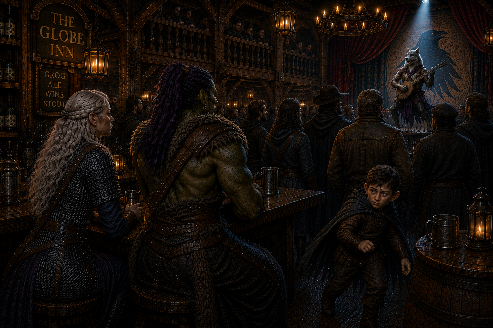

# Shaking things up in Waterford 

> *The road to Waterford began with a missing wagon. By midnight, Ravenlost was robbing a mausoleum.*

---

## Good riddance, Crawford

After a night of drinking, celebrating, and Cadric performing a rendition of “Shake It Off,” inspired at least partly by Jain’s habit of shaking herself dry,  Ravenlost finally turned north toward Waterford. Cadric’s performance earned him eleven copper, which wasn’t exactly a fortune, but it was eleven copper more than he’d had before.

And now, Crawford was behind them. That was probably for the best.

The road followed Starling Brook north. Waterford was only six or eight miles away, but the party had another reason to pay attention along the way. A supply wagon from Waterford had never reached Crawford. They’d been told that if they happened to find it, anything salvageable was theirs.

Two hours into the journey, Jain found it.

---

## The missing wagon

The wagon had gone over the side of the road and down an embankment, flipping several times before coming to rest below. Barrels had broken open. Grain and food were scattered through the mud alongside fishing line, rods, and other supplies.

There was blood inside the wagon. There were also drag marks on the ground around it. Jain continued studying the ground and found two sets of relatively fresh humanoid footprints leading away from the wreck. Alongside them were tracks from two ordinary-sized hunting dogs. Whatever had happened here hadn’t happened very long ago.

Most of the wagon’s cargo was exactly what they expected: provisions destined for Crawford. One crate, however, stood out. It had been packed far more carefully than everything else and marked with the insignia of a raven. Inside that crate were children’s clothes and medical supplies, including needles and other equipment that had apparently been destined for Crawford Manor. Buried among them was a smaller locked box, and inside that box was a stone. It was smooth granite, roughly the size of a cue ball, with a tiny humanoid face carved into its surface.

And it was magical.

Jain slipped it into her bag. She didn’t mention this to anyone else.

Then Ravenlost followed the tracks into the woods.

---

## Monster hunters

The trail led to a cave. Jain and Cadric snuck into the cave and heard voices, and they were spotted by a dog. Not able to hide any longer, they moved further into the cave and made themselves known. 

Inside, they saw what remained of the wagon’s horse, badly mauled and already decaying. Nearby lay the partially eaten remains of a man. Three other bodies were different. Two were ghouls. The third was a ghast. All three were already dead.

More importantly, someone was still in the cave. Two women stood among the remains with a pair of hunting dogs. One of the women was heavily armed; the other had lights floating around her. They were responsible for the dead undead, and, fortunately, didn't appear interested in adding four members of Ravenlost to the collection.

The more talkative of the sisters introduced herself as **Jennifer**. Her quieter sister was **Lori**. Their dogs were **Joan **and **Tiron**. The dogs had silver caps fitted over their canines.

That got their attention.

Jennifer and Lori were monster hunters from Mordenshire, hired by **Farrow **of "Farrow and Thorn" to determine what had been attacking travelers along the road. Judging by the bite marks, the bodies, and the three dead creatures at their feet, they’d found the answer. They intended to search the surrounding woods before moving on, just in case the ghast and ghouls hadn’t been alone.

Jain listened and ate some of the dead horse.

They moved their conversation outside of the cave. After meeting Bia and Elisandra, everyone sat down for a drink. Bia poured the sisters some mead, and the sisters gave Ravenlost several new leads.

If they were going to continue fighting monsters, Jennifer and Lori recommended **Rudolf Fanbreaking**, an herbalist in Mordenshire who could supply them with the appropriate equipment. They also mentioned rumors from Glaston: a druidic group there was supposedly attempting to find a way through the Mists.

But when Ravenlost’s future travels turned toward the territory associated with Wilfred Godfrey, Lori finally had something to say.

“Get stronger first.”

Coming from a professional monster hunter, that seemed worth remembering. 

The sisters also happened to be the daughters of **Alice**, the mayor of Mordenshire. This was all potentially useful information. 

Eventually, the two groups parted ways, and Ravenlost continued toward Waterford.

---

## Farrow’s offer

Waterford was substantially larger than Crawford, with roads and waterways converging around the town. The party made its way to the Globe Inn and, more importantly, right across the road they found "Farrow and Thorn," a warehouse that distributed supplies to Crawford.

Ravenlost were looking for work, and Farrow had some. He mentioned two jobs.

The first job involved a merchant vessel wrecked on a sandbar in the Argent River north of town. Somewhere aboard was a portrait that a client wanted recovered. The second concerned the Waterford family mausoleum. Farrow wanted a jeweled walking cane that had belonged to Lord Waterford.

Farrow offered 200 gold total for the group to complete the first task. Cadric negotiated. By the time Cadric was finished, the deal was that each member of Ravenlost would receive **180 gold for successfully completing both tasks**.

Then Farrow mentioned a third job. Naturally, Ravenlost wanted to know what it was, but Farrow refused to tell them specifics. "Complete the first two jobs," he said, and then they could hear about the third.

Fine. They'd start with the shipwreck.

Cadric then negotiated (borrowed) some leather straps and a waterproof sack to transport the portrait off the ship.

---

## The woman in the portrait

The wreck lay moored on a sandbar in the Argent River, surrounded by dangerous currents.

Getting aboard required rope, some improvisation, and Cadric’s leather straps. Specifically, Bia attached Cadric to a rope and threw him so far, he landed in the water on the opposite side of the ship. He then found a spot to scamper up onto the ship.

Jaine followed. With Bia holding Jain's rope, Jaine jumped into the water and swam with the strong current to the boat. As she neared, Cadric reached his little arm down in a comical attempt to catch Jany if she swam by. Jain brushed him off and jumped onto the stranded vessel, and they began searching.

There was plenty worth finding. Jain came away with a gold necklace set with an emerald worth one hundred gold. She also found two copper and a pristine scimitar. Cadric found a silver ring and two hundred gold accompanied by an invoice to **Old Books**.

Then they found a portrait. It had been carefully protected against the water, and despite everything that had happened to the ship, the painting itself remained intact. It showed a woman none of them recognized.

Jain looked at her, and the woman’s mouth moved. She would keep this little tidbit to herself for now.

The next step was to return to shore. This was less tricky, as Bia was able to pull them both back to shore. But now that they had the painting, Ravenlost started thinking, which was never a good sign.

Farrow had offered them good money for the painting, but now the party began wondering exactly what they’d recovered—and whether Farrow was really the person who should receive it. Perhaps its actual owner would pay more.

They returned to Waterford with the portrait but didn't deliver it. Instead, they rented rooms on the top floor of the Globe Inn.

Cadric performed downstairs. While attention was on him, the rest of Ravenlost were able to get the portrait upstairs unnoticed. This involved a rope and a third floor window. And for the moment, the woman was staying with Ravenlost.

---

## How to rob a mausoleum

Farrow’s second task presented a different problem. The Waterford family cane was somewhere inside the family mausoleum. The mausoleum was inside the cemetery. And the cemetery had its caretaker: **Edgar**.

Cadric had a plan. He ventured into the cemetery and approached Edgar with a perfectly innocent question: suppose a devoted son wanted to purchase a burial plot for his mother?

That simple conversation got him information about the cemetery, but it also produced something stranger. He learned about **Idlethorp**, an abandoned settlement southwest of Waterford. A man **Jeremiah** had recently gone there and returned with stories about something horrifying. Something involving a creature with a great many hands.

That sounded like a problem for another day.

Tonight’s problem was Edgar’s keys. So Ravenlost invited him for a drink. As it was nearing the end of Edgar's shift, he stopped at his house to drop off his keys. Then he and Cadric made their way to the Globe, and Cadric bought Edgar a drink. And then another.

Jain went on stage and performed “Jar of Hearts.” The entire bar couldn't look away. During this distraction, a small amount of hemlock taken from Crawford Manor somehow found its way into Edgar’s drink. A special Cadric cocktail. Soon after, Edgar passed out at the bar.

With Edgar roofied, and Jain's performance complete, the team headed to Edgar's house, which was conveniently located next to the cemetery. They picked the lock while a dog inside barked. As they opened the door, a pomeranian ran out and then went straight to the bar. They watched for a moment, then took Edgar’s keys off his key rack. And by approximately eleven-thirty that night, they were standing inside the Waterford family mausoleum.

They weren’t alone.

---

## Lord Waterford

The museum appeared to be made up of a large main room with several rooms coming off that room. The main room was adorned with four large statues–one in each corner.

Then a ghost appeared before them. He introduced himself as **Lord Waterford**. Something had been disturbing his family’s resting place, keeping him awake, and Ravenlost had arrived at an opportune moment to help him locate and remove it. Lord Waterford guided them through the mausoleum and into the spaces beneath it.

He spoke about his family. He spoke about their mausoleum. And he spoke about the Waterford family home. He even told them where they could find Waterford Manor. But there was a problem with that.

**Waterford Manor no longer existed.**

Lord Waterford didn't seem to know this. And none of Ravenlost offered up this information. Whatever had happened to his family’s home had apparently happened after his death, and the ghost remained oblivious to it.

There wasn’t much time to contemplate what that meant. Something was moving beneath the graves.

---

## Things beneath the dead

The mausoleum opened into cramped tunnels with burial chambers beneath the cemetery. Something had been moving through them. Graves had been disturbed. Wood had been broken. Then came the scraping.

Ravenlost gathered near the doors and prepared an ambush. For once, there was something resembling a plan. Two gaunt undead creatures came through toward Elisandra and Cadric, but first had to get past Jain and Bia.

The plan rapidly became less organized.

The fight spilled into the tunnels beneath the crypt. Jain fell roughly ten feet into the darkness below and found herself fighting undead at close range.

Things continued going badly. She went down. For a moment, Jain lay unconscious at the bottom of the Waterford mausoleum with the undead around her. The others managed to reach her, stabilize her, and get her back into the fight. Eventually, Ravenlost prevailed, and the creatures of the crypt stopped moving. Because they were dead.

Ravenlost, though, didn’t stop moving. Elisandra and Bia continued following Lord Waterford around his family’s resting place. Jaine and Cadric headed toward the three tunnels that went beneath the crypt.

---

## The Waterfords

Lord Waterford knew exactly who was buried where. He pointed out relatives to Elisandra and Bia and told them what he knew about each of them.

Among those crypts were his grandparents, his parents, his aunt and uncle, and his wife. More interestingly, he told them about the treasure that each was buried with. Coming to his own crypt, he mentioned that he himself was buried with a jeweled walking stick. As Lord Waterford began walking away Elisandra attempted to open the crypt just enough to loot it, but the lid was heavy and loud, and it barely moved. There was no way to push it open further without Lord Waterford knowing.

And then they came to the tomb of his great-grandfather, **Jeremiah**, the relative who had built the mausoleum for himself and his descendents. Jeremiah’s tomb was not to be disturbed. That seemed clear enough, right?

The four statues in the corners represented the generations of men: his father, grandfather, and great-grandfather. The fourth was an unfinished statue of Lord Waterford himself.

Finally, Lord Waterford said his goodbyes and withdrew into his own tomb, where his ghost disappeared.

Finding nothing in the tunnels except dirt, Cadric and Jain made their way back to the crypt. And for the first time since entering the family crypt, Ravenlost was alone with the Waterfords. The dead Waterfords. And all of their possessions.

The party separated into different rooms and began opening crypts. There was gold, there was jewelry, there were glasses, and a journal. One corpse had approximately two hundred gold arranged around it. Another yielded a gold ring. Ravenlost worked its way through generations of Waterfords. Curiously, the tomb belonging to Lady Waterford was completely empty.

Cadric and Elisandra then opened Lord Waterford's crypt. Inside, they acquired a jeweled cane, decorated with gold, tipped with obsidian, and set with a large ruby.

Task two was complete.

There was, however, still one tomb left untouched—the one they had been told not to touch.

Jain looked at Jeremiah Waterford’s tomb. And as Jain was Jain, she started to pry it open, just as Bia entered the room.

**Click.**

Everyone heard it, even Cadric and Elisandra, still in another room.

And then the doors to the other rooms closed. Trapped in the main room, three large statues awoke and moved toward Jain and Bia.

---

## The stone guardians

The three large stone figures that had stood silently within the mausoleum for generations had come to life. Apparently, the prohibition against disturbing Jeremiah’s tomb had included some fairly good reasons. Ravenlost barely had time to react before they were fighting again.

Locked out of battle in the other room, Cadric and Elisandra noticed that a shape on the cane exactly matched a shape on the door of their room. A key. They could use the cane to open the door and help Jain and Bia.

Bia raged and threw herself into melee. Jain marked her prey. Entering from the now unlocked room, Cadric hurled insults sharp enough to qualify as magic. His dagger proved particularly effective against creatures made of stone.

The guardians hit back hard, and the confined crypt gave the party little room to maneuver. And after the undead fight, only Elisandra had entered this second battle particularly fresh. 

Eventually, stone cracked, and statues crumbled. One by one, the guardians fell apart, and eventually the mausoleum was quiet again. This time, Jeremiah’s tomb could be opened.

There was no point wasting the opportunity. Inside lay a massive axe. And it was magical.

**Bia took Jeremiah Waterford’s +1 great axe.**

---

## Home

By the time Ravenlost finally left the cemetery, they had accomplished what Farrow had asked. They had recovered the portrait, and they had recovered Lord Waterford’s cane. This meant that Farrow would finally have to tell them about his mysterious third task.

But the night’s discoveries had made the first task considerably more complicated.

The portrait was still hidden at the Globe Inn. The woman inside it remained unidentified. And somewhere beneath the Waterford mausoleum was an empty grave belonging to **Lady Waterford**. Maybe that meant nothing. Maybe it meant everything.

There was something else, too. Something only Jain knew. The portrait was supposed to go **home**. Lord Waterford had told them where his family’s home should be. Waterford Manor. But that was a manor that no longer existed.

Perhaps the woman in the portrait was Lady Waterford. Perhaps finding her body would explain the empty grave. Perhaps taking the portrait “home” meant returning both the woman and the portrait to the family tomb. And perhaps Farrow’s mysterious third task had something to do with all of it.

Or perhaps Ravenlost was doing what Ravenlost did best: finding a few unanswered questions and turning them into considerably more unanswered questions.

For now, they returned to the Globe Inn. They cleaned off the mud, blood, grave dust, and whatever else they’d accumulated over the course of the day. Then, finally, they slept. When they woke, they would be stronger.

**Ravenlost had reached Level 3.**

And somewhere upstairs, a woman in a portrait was still waiting to go home.
