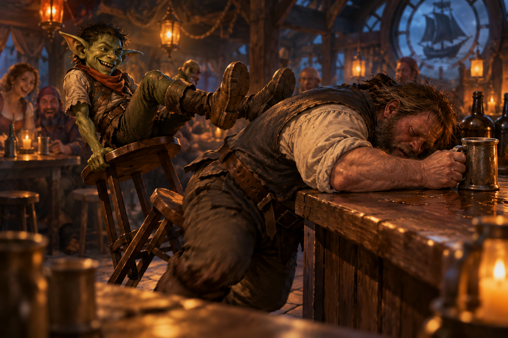

# It’s been a long week

> *A little murder, a little sailing, and some exquisite grass. Somehow, this all counts as progress.*

---

## Everything went to hell

Everything went to hell. (This bears repeating.)

Fire spread across the floor of the ICU as Dr. Dave turned and ran deeper into the sanatorium. Trashcan emerged from the high-risk patient area and headed toward the stairs. And Jain was still holding Dr. Caroline.

That presented a problem. Dr. Caroline was badly injured, unconscious, and now lying in the middle of a fire. Ravenlost had come to the sanatorium to investigate what was happening there, not to murder its director. More importantly, Dr. Caroline knew things they needed to know.

Jain herself was less concerned about that distinction. Still, she wasn't going to leave Dr. Caroline lying in the flames. Jain dragged her out of the fire and toward the stairs, although moving an unconscious human proved considerably slower than moving herself.

Once they were clear of the flames, Jain looked down at the limp doctor.

"Can I bite her head?" she wondered.

Apparently, she could. Jain leaned down and caught Dr. Caroline across the cheek. It wasn't much of a bite, but it left a bloody scratch. Dr. Caroline remained limp in her arms. There were more immediate problems.

In the ICU, Dr. Dave raised his hand again and hurled another Fireball. This one missed, and Dave turned and fled down the hallway. Bia grabbed a set of orderly keys from the ground, then went after him.

Cadric—still enlarged and disguised as Dr. Caroline—had another problem to deal with. The enormous, silent orderlies had already demonstrated that they responded to Dr. Caroline's voice. Now, as far as they could tell, Dr. Caroline was standing in front of them giving orders. Cadric intended to take advantage of that for as long as possible. He ordered the orderlies to follow him, and they headed after Dr. Dave.

Elisandra, meanwhile, cast Bless on Bia, Jain, and Trashcan, then turned her attention to the fire.

Trashcan had apparently decided to join the rescue effort. He shuffled from door to door, attempting to pick the locks and free the other patients. It wasn't going especially well. But at least he was trying.

And somewhere in a hallway ahead of Bia and Cadric, Dr. Dave was trying to get away.

---

## The man behind the door

Bia chased Dr. Dave deeper into the ICU. Cadric followed with two orderlies in tow, still wearing Dr. Caroline's face. He tried to stop Dave with Hold Person, but Dave resisted the spell and kept running.

At the end of the hall, Dave opened a reinforced wrought-iron door and barricaded himself on the other side.

That left Ravenlost with the fire, the patients, and whatever else Dr. Caroline had been keeping behind locked doors.

Bia picked up a set of orderly keys and continued through the ICU. Behind one door, she found a pristine white room containing two surgical beds. It looked less like a hospital room and more like a place where something was done to people. Cadric was nearby, with two orderlies in tow.

Elsewhere, another door opened. A huge, naked man covered in scars emerged from the room. He was muscular, furious, and immediately focused on Cadric. Or, more accurately, on Dr. Caroline.

The man charged. Bia managed to shove him back, buying Cadric a little space. Cadric immediately ordered the two orderlies to restrain him.

They tried. The man fought them with startling violence.

Ravenlost wasn't certain, but they assumed they finally found Wendel, the patient Bia had been warned about downstairs and the one who had gone into the ICU a week earlier and never returned. Whatever Dr. Caroline had done to him, seeing her face had sent him into a rage.

Cadric had picked a very unfortunate night to look exactly like her.

Meanwhile, the fire was still spreading. Elisandra entered a janitor's closet in the second floor lobby. It was stocked with buckets of water, as each janitor's closet was. She grabbed two of them and began putting out the flames.

Trashcan continued trying to free patients from their rooms. Using the staircase nearer the nurse's station, which wasn't on fire, he went downstairs to warn the other patients and staff. "Trashcan!"

The current situation bore no resemblance to an undercover investigation. Ravenlost was now trying to catch a fleeing doctor, contain a fire, evacuate a sanatorium, restrain a violently enraged patient, and figure out what had been happening inside the ICU.

And Cadric was doing his part dressed as the woman who appeared to be responsible.

---

## Dr. Caroline

While the others chased Dr. Dave and dealt with Wendel, Jain stayed with Dr. Caroline. At one point, she checked the doctor's pulse.

There wasn't one. Dr. Caroline had stopped breathing.

Jain considered the situation. The doctor had been poisoned, choked, bitten, caught in a Fireball, and dragged through a burning sanatorium. Now she was dead.

Jain had also stripped her to use that clothing to choke her. This now suddenly seemed like it might require some attention. If the guards were going to find the director of the sanatorium dead, Jain decided they probably shouldn't find her dead and naked in a janitor's closet.

She put some of Dr. Caroline's clothes back on her. Then she and Elisandra turned their attention to the reason Ravenlost had infiltrated the sanatorium in the first place. They walked upstairs to the third floor and used Dr. Caroline's keys to enter her quarters.

They began investigating. And the deeper they searched, the worse things looked.

They found rooms equipped for surgery. They found patient records that documented failures, brain injuries, aggression, and experiments on the people Dr. Caroline had been treating.

They also found plans for the remodeled section of the sanatorium—the same restricted area that contained the ICU. The addition had been privately funded. The name attached to the funding was Lord Godfroy.

For the first time, Ravenlost had something concrete connecting Godfroy to what was happening inside the sanatorium.

They didn't yet know how much he knew about Dr. Caroline's experiments or exactly what he expected in return for his money, but he was involved.

And Dr. Caroline was no longer available to explain why.

---

## A roadmap to control

Jain and Elisandra continued searching Dr. Caroline's quarters.

Inside a locked chest, they found an old set of doctor's robes. The name stitched beneath the breast pocket was Dr. Edgar Iskander, and the robes were from Locust Branch Hospital in Crawford.

They also found an old pencil sketch of a man holding a young child. On the back was a handwritten message:

“To my dear star, I’ll make the world a safer place for you.”

There was nothing explicitly identifying the man or the child, but the pieces suggested a connection. Dr. Caroline had kept Dr. Edgar Iskander's robes. She had kept the portrait. And the message sounded like something written from a parent to a child.

The evidence became even more interesting when they searched the desk. Inside one of the drawers was a thin journal.

*Control: A Roadmap*, By Dr. Edgar Iskander

The handwriting matched the inscription on the back of the portrait.

Whatever Edgar had promised his "dear star," his idea of making the world safer apparently involved experimenting on people's brains. The journal described research conducted decades earlier into manipulating specific parts of the brain. The experiments could affect memory, aggression, and—most importantly—how susceptible someone became to commands.

Suddenly, the enormous, silent orderlies made considerably more sense.

And the journal offered a likely explanation for what had happened to Wendel. Ravenlost had already assumed the enormous scarred man was the patient who had disappeared into the ICU a week earlier. Now they had a much better idea of what Dr. Caroline had been doing to him there.

The patient records scattered through the room added to the picture. Most of the names had been crossed out and marked with notes indicating failed experiments or unsuitable subjects. "Anne" had died during surgery. Trashcan had apparently baffled Dr. Caroline enough to earn several question marks.

Wendel's name was there. So was Peter's. And at the bottom of the list was the newest entry:

"Lupine — promising candidate"

Jain had been inside the sanatorium for less than a day. Apparently, Dr. Caroline already had plans for her.

---

## Cookies make everything better

Once Cadric no longer looked like Dr. Caroline, Wendel's behavior changed. He was still enormous, scarred, and furious. But he no longer seemed particularly interested in attacking Cadric.

Cadric decided to try a different approach.

"Do you want some food?"

Wendel did. There was, however, still the matter of the two orderlies standing in the hallway.

The orderlies couldn't disguise themselves. Wendel killed them. Then he followed Cadric downstairs to the kitchen.

Cadric found the molasses cookies. Who doesn't like cookies? Wendel certainly did. He ate. Fast. Cadric kept feeding him. When the cookies ran out, Cadric found some extra stew.

It wasn't sophisticated medicine, but sitting in the kitchen powering down cookies and stew with Cadric seemed to be doing considerably more for Wendel than anything Dr. Caroline had done.

Upstairs, Dr. Dave moved into a far room, locked himself in, and screamed.

"Leave me alone!"

He cast a thunderwave that hit Bia in the hallway. As she was unable to unlock the door, she backtracked. With one eye on the hallway, ensuring that Dr. Dave couldn't move past her, she investigated the nearby rooms more closely. One contained the surgical tables she'd already seen. The other held a chair designed to restrain someone upright during brain surgery.

With Bia distracted, Dr. Dave took this opportunity to disappear.

Meanwhile, Cadric was ready to find somewhere safer for Wendel. Dr. Caroline's quarters were secure, with reinforced windows and a proper bed.

Cadric brought Wendel upstairs.

"This is your new room."

Wendel looked around. He clearly didn't like the surgical table in the corner, but he noticed the bed, climbed onto it, and curled up.

Cadric tucked him in.

Back on the second floor, Bia noticed it had gone quiet. She went toward his cell but he was gone. Behind a door in the center of the room, she discovered a closet, and inside the closet was a ladder. An easy getaway for Dr. Dave.

Bia climbed.

The ladder led to the roof. In the yard, Bia could see guards from the garrison entering the grounds. And on the roof with her, there was Dr. Dave.

He hadn't fled very far. Instead, the badly burned doctor was outside Dr. Caroline's quarters, trying to break through one of the windows. Through the glass, Bia could see the rest of Ravenlost inside with Wendel.

"DR. DAVE!"

The glass was thin enough that everyone inside heard her. They looked toward the window. There was their missing doctor.

Cadric cast Suggestion. Looking out the window, he'd also seen the guards approaching.

"Go surrender yourself to the guards. Let them take you into custody and be nice and cooperate."

Dave's expression went blank. He stopped trying to break into the room, climbed down from the roof, approached one of the guards, and announced that he would like to be arrested.

After everything else that had happened that night, at least one problem had solved itself relatively neatly.

---

## The missing nightwatchman

With Dr. Dave in custody, patients safe in their quarters, and guards investigating the property, the immediate danger began to subside. Ravenlost could finally return to the investigation that had brought them to the sanatorium.

Peter.

The nightwatchman had never shown up during the emergency.

Considering that part of the sanatorium had been on fire, patients were escaping, guards were running through the halls, Dr. Caroline was dead, Dr. Dave had just surrendered himself for arrest, and Peter's name was in Dr. Caroline's notes, Peter's absence was noticeable.

Ravenlost went to his hut, but he wasn't there.

Jain searched for tracks. Given the events of the evening, there were plenty. But she managed to pick out a trail leading away from the sanatorium. Now they had to decide whether to investigate Peter's hut or follow the tracks, still completely unarmed.

Bia ran quickly to the garrison and retrieved their gear. In the sanatorium, Jain asked four guards to stand watch by Peter's hut. About 10 minutes later, weapons in hand, they followed the tracks toward the docks.

By now, it was nearly one in the morning. Sailors were stumbling out of the nearby taverns and making their way back to their boats when Ravenlost spotted something moving in the water. A soaking-wet man was climbing out of the water and up one of the dock pilings. He had a knife clenched between his teeth.

It was Peter. He saw them and immediately started dropping back in the water.

Jain fired an arrow.

She missed Peter. She didn't miss an extremely drunk sailor walking toward his boat. The arrow went through the man's leg.

Peter disappeared into the water.

Bia jumped in after him.

Cadric, meanwhile, ran toward the docks calling for the guards and found the unfortunate sailor with an arrow sticking out of his leg.

The sailor was wearing an unkempt captain's uniform, a crooked hat, and smelled strongly of alcohol.

Cadric broke the arrow and pulled it free. The sailor screamed, then relaxed a bit.

"Who shot me?"

Cadric did what he could for the wound and introduced himself. The sailor introduced himself as **Jethro Fletcher**, captain of a small sloop called **The Fletcher**.

Cadric filed that information away. "I might come and ask you for a favor someday."

It was an unusual way to make a new friend. But it worked.

Out in the dark water, Bia reached the pilings.

Peter attacked her and managed to drive his knife into her. But something about Peter was off. His eyes looked cold and dead.

Bia responded with one solid punch. Peter's head snapped backward into the post. He went limp.

Bia dragged the unconscious nightwatchman out of the water and back onto the dock.

Ravenlost had finally caught the man they'd come to sanatorium to find. Now they needed to figure out whether Peter was actually a murderer or something Dr. Caroline had created.

---

## Solving a murder

It took the guards several minutes to reach the commotion at the docks. (It had been a busy night.) By then, Bia had dragged the unconscious Peter out of the water and delivered him to the guards. Jethro Fletcher had a slightly less painful arrow wound in his leg, and Ravenlost had once again left someone else with a complicated situation to clean up.

The guards restrained Peter and took him into custody. "He's not in his right mind," they told the guards. Then Ravenlost headed back to the sanatorium grounds to search his quarters.

Peter's small house was sparsely furnished. His bed was perfectly made and looked as though it hadn't been slept in for weeks. Beside it, a circular path had been worn into the floor. Peter had apparently spent hundreds of hours pacing the same small circle over and over again. There was also a chair that had been brought down from the ICU.

Then they found the daggers. A case rested on the otherwise untouched bed. It had spaces for seven matching daggers. Five were still there. Two were missing.

Ravenlost had already found daggers exactly like them while investigating the murders.

They had their murderer.

But the rest of Peter's quarters made that discovery considerably less satisfying. The untouched bed. The endless pacing. The ICU chair. Dr. Caroline's records. The surgical rooms. Edgar Iskander's research into aggression and control.

Peter had killed people. But Ravenlost was beginning to understand that Peter might also be one of Dr. Caroline's victims.

Before leaving the sanatorium for the night, Bia found Randal, Janice, and Robert. The trio had just learned that, in the 18 months since Dr. Caroline had taken over at the hospital, she had refused to approve any discharge papers for patients. With her gone, there was no longer anything keeping them there. They'd spent months—or years—inside the sanatorium and would soon be sent back into the world.

Bia gave each of them a gold piece to help them get back on their feet. Three gold wasn't much to Bia. To three people walking out of the sanatorium with very little else, it was a pretty good start.

It was now about 2:00 in the morning, and the team was thinking of sleep. Elisandra headed to the Blackard. Jain headed toward the Salty Dog. Cadric followed behind Jain at a distance, hoping for his moment.

Jain entered the Salty Dog and woke a sleeping Menda.

Menda remembered her. After all, the previous day Menda had watched Jain cause a disturbance and get hauled away to the sanatorium. Cadric had helpfully used the incident to reinforce his earlier claim that Jain was mentally unstable.

“See? I told you!”

Now Jain was back, looking for a room.

A room at the Salty Dog normally cost copper. For Jain, Menda wanted four gold. Jain argued unsuccessfully. Jain decided to leave and go to the Blackard. Before walking out the door, she left a gift for Menda in the form of a fart.

A halfling outside caught the attention of Menda.

“See? I told you!” Cadric said again.

Some jokes were worth repeating.

Bia, however, went to the Garrison and entered just as Captain Kilm was leaving. They set up a meeting at the Mayor's office for 1:00 PM the next day to debrief.

Inside the garrison, Dr. Dave was badly burned and on morphine. Peter was awake but didn't understand where he was. His last memory was going to work several hours ago.

There'd be no additional information from either of them tonight. Bia returned to the Blackard.

---

## An early morning drink

Cadric had gone to bed before the others, which meant he also finished his long rest first.

While the rest of Ravenlost was still asleep, Cadric went downstairs at the Blackard. Henry Loust was already there with an ale in front of him.

"You called?"

Cadric got one for himself and sat down. He had indeed called and had something Henry needed to know. Dr. Caroline was dead.

More specifically, Cadric expected that Dr. Caroline might eventually become one of the ghosts at the House on Griffin Hill. If she did, Ravenlost wanted information from her about what had been happening at the sanatorium.

Henry couldn't promise anything. But he did know something Ravenlost didn't. Dr. Caroline and Lord Godfroy had a deal.

Godfroy had quietly bankrolled the new wing of the sanatorium. In exchange, Caroline was supposed to supply him with things he needed.

Cadric already knew what had been happening inside that new wing: brain surgery, experiments with aggression and control, and patients who emerged profoundly changed—if they emerged at all. He asked Henry if he knew exactly what Caroline had been providing to Godfroy.

Henry preferred not to know, but Cadric wasn't entirely convinced that Henry knew as little as he claimed.

But the conversation confirmed something important. The plans Ravenlost had found weren't merely evidence that Godfroy had donated money to the sanatorium. Dr. Caroline had been working with him.

Cadric had heard enough. It was time for pastries. The others would be awake soon.

---

## The bigger problem

When Ravenlost finally awoke, Jain opened the journal that she'd pilfered.

*Control: A Roadmap* was a sort of medical diary and a how-to guide. It was apparent that Dr. Edgar was trying to figure out how to perform surgery on a brain to make someone more susceptible to manipulation. It was dated about 40 years ago, and according to his writings, it seemed he was getting close. Also, Dr. Caroline looked to be in her 40s, making Ravenlost even more convinced that she was his daughter.

From the journals, Ravenlost also learned that Dr. Edgar had lost his funding at Locust Branch Hospital when one of his surgeries had gone bad and a patient snapped.

By now, it was nearing 1:00 PM, so the team headed out to meet with Mayor Alice and Captain O'Connell to explain what they had found.

There was quite a bit to explain. Peter had almost certainly committed the murders. The guards had the matching daggers from his quarters, and Peter's unexplained nighttime activities lined up with the attacks.

But Ravenlost no longer believed he had been acting entirely of his own free will.

Peter remembered going to work the previous evening. After that, nothing. He didn't remember leaving his post, fleeing to the docks, stabbing Bia, or being knocked unconscious against a piling.

"That went faster than I thought," Mayor Alice said to them. She was now beginning to understand how Ravenlost worked.

Ravenlost showed Dr. Edgar Iskander's journal to Captain O'Connell and the Mayor. The doctor's research described ways of manipulating the brain to affect memory, aggression, and susceptibility to commands. Peter's behavior looked disturbingly similar to the effects described in the journal.

The orderlies offered even more evidence. Captain O'Connell confirmed that they didn't speak. More importantly, every one of them had identical scarring around the top of the skull.

He also provided them with more information about Peter. Peter had surgical incisions behind his ears.

Ravenlost had seen the surgical rooms. They were beginning to understand what they'd been used for.

Dr. Dave was different. He had arrived at the sanatorium with Dr. Caroline, worked alongside her in the ICU, and had actively fought Ravenlost to protect what they were doing. Whatever had happened to Peter and the orderlies, there was no indication Dr. Dave was another unwilling participant.

The captain also informed them that the body in the morgue was **Anne Polk**. She was known in town for her demeanor and her hysteric fits. She'd been a patient at the sanatorium for about 3 years.

And then Ravenlost told Captain O'Connell about Lord Godfroy.

The remodeling plans they had recovered showed that Godfroy had privately funded the new addition containing the ICU. Ravenlost believed Dr. Caroline had been continuing Edgar Iskander's research there, trying to perfect a way to manipulate aggression and control people—and that whatever she learned was intended to make its way back to Godfroy.

How much Godfroy knew about the individual experiments was still unclear. But this was no longer merely a suspicion based on the jobs he had been giving them. His name was on the remodel plans.

The sanatorium had started as an investigation into a few murders in Mordenshire. Somehow, once again, it had led Ravenlost back to Lord Godfroy.

Finally, Cadric asked the mayor for information on any scholars we might find in the three locations we'd be traveling to soon. She suggested that Cadric try Old Books in town and speak with the scribe, or reach out to Rudolf Von Richten. Either of them might be able to help.

With the meeting concluded, Mayor Alice asked them to meet her at her home, Weathermay House, at 7:00 PM that night to receive their reward.

---

## The sanatorium in daylight

After Ravenlost left the Mayor's office, they returned to the sanatorium, finally seeing it in daylight. It was still standing. Mostly.

Dr. Caroline was dead. Dr. Dave and Peter were in custody. Part of the building had burned. Two orderlies were dead. The remaining staff were trying to figure out what came next.

And with Dr. Van Larden now in charge, the patients were finally getting out.

When Bia had first arrived, Randal, Janice, and Robert had explained that patients who went into intensive care didn't come back. They hadn't known how literally true that warning was. But now, patients were being discharged and provided with 3 silver pieces each. And the facility that had held roughly twenty patients was now down to only a handful of patients and orderlies who still needed care.

Wendel wasn't leaving.

He had moved permanently into Dr. Caroline's quarters, and this morning he was digging in the garden. A dark-eyed doctor whom Ravenlost had taken to calling **Dr. Goth** was keeping an eye on him. And she was wearing plain clothes.

Wendel seemed perfectly happy digging beside someone who wasn't wearing a doctor's coat. Apparently, after everything Dr. Caroline had tried to do to him, what Wendel really needed was a garden, regular clothes, a comfy bed in a room that didn't have a surgical table, and someone willing to leave him alone for a while.

Elisandra showed Dr. Goth the journal and asked if she understood it. She had bad news and good news. The "good" news was that, when successful, the operation didn't otherwise prevent someone from living a normal life. It simply left them permanently susceptible to suggestion.

Ravenlost had different definitions of "good news."

Bia learned that Randal, Janice, and Robert had all been discharged and were currently looking for work in town. One patient, however, was still unaccounted for. Trashcan.

Trashcan had helped warn the others during the fire and then disappeared in the commotion. No one knew where he'd gone.

Elisandra and Jain went upstairs to Caroline's (now Wendel's) room to try to find any information indicating that Dr. Caroline was Dr. Edgar's daughter and any information on Trashcan. Wendel's room was a mess. The surgical table was thrown on the roof.

They found more records from Locust Branch Hospital with Dr. Edgar's name. Then Elisandra found a piece of paper from Edgar to Caroline that said, "I will always be with you." Ravenlost wondered whether "I will always be with you" might have been more literal than Edgar intended when he wrote it. If Edgar was dead, perhaps his ghost had ended up at the House on Griffin Hill. And if so, had he ever visited the sanatorium?

They found paperwork on Jain.

"Shows aggression." "Exhibits signs of submission." "She is a flight risk." "She's a perfect candidate."

They completed their investigation without finding any additional information about Trashcan. Elisandra took comfort in the realization that, somewhere in Mordenshire, there was now an unattended trash can on the loose.

Cadric found Cookie. After everything that had happened — the hemlock, the fire, the dead orderlies, the escaped patients, and the cookies that had unexpectedly become part of Wendel's treatment plan — Cadric wanted to say goodbye.

Cookie thanked him for the butter. Cadric promised there would be more, and Cookie immediately took him up on it. Cookie provided Cookie with a list of ingredients.

Bia returned to the garrison to check on the status of Dr. Dave and Peter. There was nothing new other than the Suggestion on Dr. Dave had worn off. Dr. Dave was uncooperative, and Peter was still confused.

So while the murders had been solved, what Ravenlost still didn't know was how many of them had actually been Peter's choice.

---

## Old Books

With three possible destinations and very little information about any of them, Ravenlost decided some research might be useful before choosing where to go first.

Cadric volunteered. He was already heading to town with a list of ingredients. But with this new pressing task, he instead enlisted the young **Speedy** to buy the ingredients and return them to Cookie.

At Mayor Alice's suggestion, Cadric then headed to Old Books, a bookstore near the market that was exactly what its name promised. The place smelled like musty paper and looked less like an organized shop than a building where someone had spent years accumulating books and piling them wherever they would fit.

Eventually, a young blonde woman with wiry hair emerged from somewhere behind the stacks.

“Welcome. My name is **Gilda**.”

“Cadric Veyl.” Cadric waited for a response. Gilda didn't recognize the name.

“Gilda Haywood.”

With introductions successfully accomplished, Cadric explained what he needed. Ravenlost had three leads: Welkspring House on Echo Island, the Cauldron of Tempest, and a man in Falkovnia named Mikhail Hatzimvas.

Gilda disappeared into the stacks.

She was gone for about fifteen minutes. Cadric used the time to work on his song for his gig later that night. The chorus was solid. The second verse was done. The first verse still needed help.

Eventually, Gilda returned.

She hadn't found anything useful about Mikhail Hatzimvas, but she'd had better luck with Echo Island. She found a record of the ownership of Welkspring House and a botanical guide written by its most recent owner, **Osgood Escar**.

The house had belonged to the Welkspring family before Osgood acquired it. More interestingly for Cadric, Osgood's botanical guide included information about hemlock, which grew naturally along the northwestern coast of Echo Island.

Cadric had recently discovered several practical applications for hemlock. Echo Island was becoming more interesting.

Gilda also found information about the Cauldron of Tempest, giving Ravenlost at least something to work with as they considered Godfroy's three leads. It wasn't enough to tell them which destination was the right one. But it was considerably more information than they'd had when Cadric walked in.

Before leaving, Cadric had one more request.

He would be in Mordenshire for another four days. If Gilda was willing, he wanted her to spend that time finding everything she could about Osgood Escar and put together a summary for him.

Gilda agreed.

Cadric paid her five silver and promised to return in four days.

Ravenlost still hadn't decided where they were going first, but by then, they should know considerably more about at least one of their options.

---

## Payment in kind

By now, it was nearing the time to meet Mayor Alice at her manor.

They found Weathermay House to the north, outside of town. Her home was a large marble manor with an adjoining mausoleum. While walking past that, it's possible one or two of the team thought, just for a moment, about "investigating" the mausoleum. But there was no time for that.

A butler let them through the locked gates and led them into a comfortable sitting room in the house. Mayor Alice was waiting for them.

Mordenshire had hired Ravenlost to investigate the sanatorium and determine whether it was connected to the murders. Technically, they had done exactly that.

They had also uncovered illegal brain experiments, exposed Dr. Caroline's arrangement with Lord Godfroy, identified the murderer, captured him alive, and helped dismantle whatever had been happening inside the ICU.

Yes, there'd been some fire damage, but Dr. Dave had started that.

Unfortunately, Alice explained to them that Mordenshire didn't have enough money available to properly reward Ravenlost for everything they'd uncovered and also rebuild the burned parts of the sanatorium. Instead, Mayor Alice offered them something else. She had three magical items.

The first was a **Periapt of Health**, a necklace that protected its wearer from disease. That went to Jain.

The second was a **Pearl of Power**, which could restore some of a spellcaster's expended magical energy. This would be useful to Elisandra.

Then Alice opened a case containing two matching daggers, one gold and one silver.

**Arum** and **Argentum**

Both were magical +1 weapons, but they'd been designed to be used together. In the hands of someone fighting with both, the pair became considerably more effective.

Everyone looked at Cadric. Cadric took the daggers.

Bia looked at the three magical rewards that had just been distributed among the other three members of Ravenlost. There were four members of Ravenlost.

Apparently, solving the murders, helping expose a brain-control operation, chasing Peter into the water, getting stabbed, and punching him unconscious against a dock piling didn't come with a magical item.

It still wasn't lost on Bia that none of them had been arrested for manslaughter. Considering how the investigation had gone, she was willing to count that as her reward.

And another reward was Cadric's upcoming gig.

---

## A paying gig

After leaving Weathermay House, Ravenlost returned to the Blackard.

Cadric had a gig.

He'd been working on a new song for several days. The chorus was finished. He had a second verse. The first verse was still a work in progress, but eventually a bard had to stop writing and start performing.

Cadric took the stage.

His song followed the adventures of a wandering halfling who could find a home anywhere—and generally leave that home with more money than he'd arrived with.

The chorus was catchy:

*With the wandering halfling, wherever he may roam,
He'll find a warm fire and he'll call it his home.
With a song in his heart and a coin in his shoe,
He'll steal your heart first and all of your silver too.*

One verse featured an orc with an axe six feet long who was extremely confident that no thief could get the better of her. But the halfling got the better of her.

Bia listened.

Apparently, Ravenlost was becoming material.

Cadric accompanied the song with magical images, creating a little cottage and then bringing the audience inside as the story unfolded.

It went over well. Very well, in fact.

Cadric had already performed at the Blackard before, but this time he was beginning to look less like a traveler who happened to own a lute and more like part of the evening's regular entertainment.

And he wasn't finished. Ravenlost would be staying in Mordenshire for several more days.

Cadric had more performances scheduled. And, apparently, more verses to write.

---

## Three quiet days

For the next three days, Ravenlost remained in Mordenshire.

Nothing caught fire. No one was murdered. Nobody infiltrated a sanatorium. Nobody robbed a mausoleum.

It was surprisingly pleasant.

Bia checked in on Randal, Janice, and Robert and discovered that all three had already found work. One was working at the Blackard, another had found a job as a runner in the marketplace, and the third was working in a nearby wheat field.

The gold Bia had given them had helped them get started. They were doing fine from there.

Jain spent some of her free time climbing the cliffs around Mordenshire. Getting up was considerably easier than getting down, but that didn't stop her.

One day, after reaching the top, she looked out toward the water. Far offshore, a trash barge was slowly disappearing toward the horizon. Sitting proudly in the middle of it was a familiar trashcan.

Jain watched until it disappeared from view. Trashcan was fine. Probably.

She didn’'t tell the others.

Elisandra, meanwhile, had acquired a raven. She spent part of the next few days hanging out with her companion and trying to teach it to talk. Progress was slow, but Elisandra was committed.

Cadric had considerably more public plans. He continued performing at the Blackard each night. His first performance had gone well. The next three went even better. By the end of his run, Cadric had earned 16 gold worth of silver from his performances.

More importantly, people kept coming back to hear him.

For a few days, Ravenlost almost looked like a group of ordinary travelers enjoying some downtime in Mordenshire.

Almost.

They still had three assignments from Lord Godfroy, a suspiciously useful sword sitting inside a Bag of Holding, equipment waiting to be collected, and a researcher at Old Books who had been spending the last several days investigating Osgood Escar.

Eventually, the quiet days ran out. Cadric returned to see Gilda.

---

## Back to Old Books

Four days after his first visit, Cadric returned to Old Books.

Gilda was ready for him. Mostly.

She was moving frantically through the shop, gathering books and notes.

"Oh, you made it back! I've been working at this for days."

She'd found considerably more information about Osgood Escar than she'd found about poisons. Osgood was a botanist of some renown who had traveled through the Mists studying unusual plants and botanical creatures. He'd eventually acquired Welkspring House on Echo Island and extensively remodeled the grounds.

That had happened 73 years ago. There was one problem with that. Osgood was human, but Gilda hadn't found any record of his death. She had, however, found several of his books. One was an Encyclopedia of Poisons of Ravenloft. Others covered his botanical research.

And several were dedicated to the same person. Glim Brightstone.

The dedications described Glim affectionately: a friend, a helper, and someone who was always at Osgood's side when he needed them. Apparently, Osgood and Glim had first met in Borca, a domain known for its unusual plant life—and its two dreadlords. The more Cadric read, the more the relationship between Osgood and Glim sounded like it might have been considerably closer than professional colleagues.

Gilda hadn't found anything connecting Osgood to Lord Godfroy. That was probably good. But she had found enough to make Welkspring House considerably more interesting.

Ravenlost had been looking for Glim Brightstone. Now they had a human botanist who had known Glim personally, had written about Glim repeatedly, had purchased a house 73 years ago, and apparently had never died.

And, conveniently, he lived on the one island where Cadric could replenish his supply of hemlock. Echo Island was looking better all the time.

---

## Choosing a direction

Ravenlost had three leads and, thanks to Gilda, considerably more information about one of them.

There was the Cauldron of Tempest, somewhere beyond the Mists and associated with stories of resurrection.

There was Mikhail Hatzimvas in Falkovnia, who ran a hospital for people suffering from the region's undead affliction.

And there was Welkspring House on Echo Island, home to a human botanist who had purchased the property 73 years ago, had apparently never died, and had known Glim Brightstone well enough to dedicate multiple books to them.

Echo Island also had one other advantage. They could get there without traveling through the Mists.

That made the decision considerably easier. Welkspring House would be first.

Before leaving Mordenshire, Ravenlost collected the various things they'd commissioned around town.

Jain picked up the silver canine caps Van Richten had made for her. They fit over her teeth, giving her a new option the next time she encountered something that didn't respond particularly well to ordinary weapons.

Jain had also left her shortsword with the blacksmith to be silvered. That process took considerably longer. Only one weapon could be done at a time, and it would take about a week. That was a problem Cadric had narrowly avoided. He'd considered having his own shortsword silvered, but instead he'd accepted the magical +1 shortsword Lord Godfroy had loaned him.

Of course, that sword also allowed Godfroy to scry on him. But it remained safely inside the Bag of Holding whenever Cadric wasn't using it.

Cadric and Elisandra also picked up their EC Lights from the blacksmith. Then they picked up their belts and Cadric's pouch from the leatherworker.

By the morning of the fourth day of quiet, Ravenlost gathered the rest of their equipment, finished their errands, and prepared to leave Mordenshire.

Now they just needed transportation.

---

## A ride to Echo Island

Fortunately, Ravenlost already knew a sailor with a boat.

Unfortunately, Jain had shot him.

They found The Fletcher tied up at the docks, but its captain was nowhere to be seen. Eventually, they tracked Jethro Fletcher to The Seventh Sea.

He was face-down on the bar, hands still wrapped around a mug. Beside him, a small goblin was happily spinning himself around on a barstool. This was **Gobbo**, Jethro's first mate.

Ravenlost asked Gobbo about the proper procedure for waking his captain. Gobbo swung himself sideways, raised both feet, and kicked Jethro as hard as he could.

Jethro hit the floor. He was awake.

Ravenlost had found their captain.

"Where are you trying to go?"

"Echo Island."

Jethro could do that. Better yet, reaching Echo Island didn't require traveling through the Mists.

When Ravenlost mentioned Welkspring House, however, Jethro drew a line. He would take them to the docks on the southern side of the island. He wasn't going anywhere near that house.

That worked for Ravenlost.

Jethro initially offered to take them there for free. After all, he owed them.

Ravenlost, who had recently shot him in the leg, had a somewhat different understanding of who owed whom.

They offered to pay.

Jethro asked for three cases of liquor. Ravenlost offered six.

Negotiations were going extremely well.

Eventually, they settled on six cases, costing 36 silver. Jethro would get one case before they left, two more when they reached Echo Island, and the final three after Ravenlost returned.

That gave him a reason to wait for them. It also gave him two cases of liquor while he waited.

Everyone seemed satisfied with this arrangement.

Jethro estimated that the trip would take about twelve hours, assuming the weather cooperated. Leaving that morning would put them at Echo Island sometime around 8:30 that night.

Arriving at a mostly wilderness-covered island after dark sounded like an excellent plan. At least they had lights.

Before boarding, Bia made one final trip to the bakery and bought a box of pastries for the journey.

Then Ravenlost boarded The Fletcher. Gobbo scrambled around the rigging preparing the sail, Jethro got them underway, and Mordenshire slowly disappeared behind them.

Everything seemed to be going swimmingly.

---

## Weather permitting

For the first half of the trip to Echo Island, everything went surprisingly well. The weather was pleasant. The water cooperated. The Fletcher made good time.Ravenlost had apparently found a form of transportation that wasn't going to try to kill them.

Then the weather turned.

As they approached Echo Island, the wind picked up and the waves grew rougher. Jethro struggled with the rudder as the boat began fighting against him.

He started shouting orders.

"Strong one! Take the main line!"

Bia looked at him. "What's the main line?"

They were off to an excellent start. Apparently Bia needed to have spent her down time taking sailing lessons.

Jethro pointed to the large rope coming off the sail. "That! Hold it! Don't let it go!"

Bia grabbed the line. Gobbo joined her, although "joined her" mostly meant hanging from the rope while the wind whipped him around.

Jethro put Jain and Elisandra on the rudder. Together, they fought to keep it steady as the waves tried to knock The Fletcher off course.

Cadric had an equally important job. He sang a sea shanty.

It wasn't one of his better performances.

Fortunately, everyone else's work made up for it.

Bia kept control of the sail. Jain and Elisandra held the rudder steady. Jethro somehow kept the boat pointed toward Echo Island.

Eventually, through the darkness and the storm, land appeared.

The island was mostly surrounded by cliffs. On its southern shore was something that could generously be described as a port. It had one dock. Jethro brought The Fletcher alongside it.

Ravenlost had made it to a stormy Echo Island. Alive. Again.

---

## Exquisite grass

The southern shore of Echo Island wasn't much of a settlement. There was a single dock with another small fishing boat and a few buildings clustered near the water. Beyond them was mostly wilderness.

As The Fletcher pulled in, the door of one of the houses opened. An older, weathered man in a canvas raincoat emerged carrying a shielded lantern. He hurried down to help secure the boat.

"Are you all right? You make port okay?"

Technically, yes.

The man introduced himself as **Chauncey** and invited everyone inside to get out of the storm and dry off.

Once they were settled, he had a reasonable question. What exactly had brought them to Echo Island?

"Just sightseeing."

Chauncey looked confused.

"What sights?"

"The trees. The rocks. The whole island."

Jain considered this. "Grass. I'm a fan of grass, and I've heard there's exquisite grass here."

This didn't appear to answer Chauncey's question.

Ravenlost tried another explanation. They were a traveling troupe of circus performers.

That worked considerably better. Cadric was the entertainer. Jain could climb pretty much anything. Elisandra was new, and she was still teaching her bird to talk. And Bia could toss logs.

Chauncey was delighted. He wanted to see an act. Ravenlost had just survived a twelve-hour boat ride that ended in a storm, but Chauncey had given them shelter.

So Cadric performed. He even gave Chauncey the second verse of his new song.

Whatever doubts Chauncey might have had about the strange group that had arrived on his doorstep disappeared. By the end of the evening, he was a Cadric fan.

Ravenlost spent the night at his house. Everyone was tired, and no one bothered keeping watch. Thankfully, nothing happened. And for once, that was actually true.

By morning, the storm had passed. When Ravenlost asked about Welkspring House, Chauncey told them it was roughly a two-hour journey inland. He didn't go that way himself anymore.

"The woods are weird now."

That was useful information.

More useful was a name. **Ava** had once worked as the groundskeeper at Welkspring House. She lived nearby and knew the property. If Ravenlost wanted to know what they were walking into, they should talk to her.

---

## The former groundskeeper

Before setting out, Ravenlost took advantage of Chauncey's hospitality for breakfast. Chauncey supplied the small settlement with fish and offered everyone one smoked fish for free. There were also some pastries left over from the previous day.

Then Ravenlost went looking for Ava. They found her near her log cabin, felling a tree.

Ava was muscular, with short brown hair, and looked entirely capable of taking care of herself. More importantly, she'd once been the groundskeeper at Welkspring House.

She didn't work there anymore. According to Ava, she'd been told to stay away for her own safety. She'd even been given approximately a year's wages when she left.

That got Ravenlost's attention.

For about the last six months, Ava had occasionally noticed strange figures moving through the woods at the edge of her vision. She could never get a good look at them. Sometimes they appeared small. Sometimes tall and thin. Sometimes somewhere in between, but broader. They never stayed around long enough for her to determine what they were, and they didn't leave tracks behind.

Ava hadn't returned to Welkspring House since leaving. She could, however, tell Ravenlost how to get there. There were two options.

They could follow the established route through the woods. It would take longer, but it was safer. 

Or they could take a more direct route through the forest. It was faster. It was also considerably more likely to put them in the path of whatever had been moving through the trees.

Ravenlost considered these options.

They decided to take the shortcut.

Of course they did.

---

## The shortcut

The shortcut began pleasantly enough. Echo Island was covered in a thick, temperate forest. Sunlight filtered through the trees as Ravenlost worked their way north toward Welkspring House.

After a while, Jain noticed something. Or more accurately, she noticed nothing. The forest was silent. No birds. No animals moving through the undergrowth. Nothing except the wind through the trees.

Then Jain caught a glimpse of something humanoid peeking around a tree ahead of them. It disappeared almost immediately.

Ava's warning suddenly seemed considerably more relevant.

Cadric tried a bird call. It was actually quite good.

Something answered him. With a thorn.

The projectile buried itself in the side of Cadric's neck. So much for the birds.

More figures then emerged from the trees. Some were smaller humanoid shapes covered in needles and thorns. Others were larger creatures formed from twisting vines.

Ravenlost fought back.

The smaller creatures fired volleys of needles from the surrounding woods. One of the larger creatures lashed Elisandra with vines. Bia struck another hard enough to sever its arm. The vines immediately began slowling growing back.

"Guys, I just cut off one's arm and it's growing back."

That was useful information.

The fight continued as more of the creatures emerged from the trees. Ravenlost killed several of them, and eventually the survivors decided that whatever they'd hoped to accomplish wasn't worth dying for.

They scattered back into the forest. Ravenlost let them go.

About half an hour later, they finally reached a clearing.

Twenty feet ahead stood an eight-foot wrought-iron fence, with tall, carefully maintained hedges rising behind it.

They'd found Welkspring House.

"I think we made it, guys," said Jain. Aren't you glad we took the shortcut?"

Cadric pulled the three-inch thorn out of his neck and put it in his bag.

"We've all gotten a splinter before."

Apparently, the shortcut had been a success.

---

## A familiar design

Beyond the wrought-iron fence, Ravenlost found an open gate. That was either welcoming or concerning.

Inside, a winding path led through immaculate gardens toward an enormous estate. The manor itself was impressive, but beside it stood something even larger: a massive greenhouse packed with greenery.

Off to one side was a carefully maintained topiary garden filled with animals. Ravenlost considered investigating it. They also considered whether the topiary animals might come alive and attack them.

They decided to leave the topiaries alone. For once, restraint won.

They followed the path to the manor instead. The front entrance stood above a raised porch reached by two staircases. Ravenlost climbed the steps and knocked on the large French doors.

From inside came a voice. "Just a minute." Then came the unmistakable whirring of machinery.A small figure slowly opened the door.

It was an automaton, only about three and a half feet tall, with a humanoid upper body mounted on a ball instead of legs.

Every member of Ravenlost had the same thought.

Cedgewick.

It obviously wasn't Cedgewick. But the construction was familiar enough to immediately remind them of the automaton they'd found in Glim's laboratory.

"How can I hel hel help you?" it stuttered.

Ravenlost explained that they were there to see Osgood Escar.

"Mmm master is up up upstairs."

The automaton told them it would be right back. Then it rolled over to the staircase. And ran directly into the bottom step.

Thump.

It tried again.

Thump.

And again.

Thump.

The metal ball beneath it was extremely effective for moving across a flat floor. It was less effective at stairs.

Eventually, a voice called down from above.

"Just give me a moment."

The automaton stopped trying to climb. Ravenlost waited.

After several minutes, they heard a cane strike the floor upstairs. Then a footstep. Then the cane again. Someone was coming down.

---

## Laying the cards on the table

The man coming down the stairs introduced himself as Osgood Escar. He couldn't have been older than his late fifties. He had salt-and-pepper hair, an eye patch, and clothes that looked like they'd seen considerably more gardening than laundry. His left leg was badly gnarled, forcing him to walk with a cane.

His right hand was missing. In its place was a bright silver mechanical hand. Ravenlost noticed that.

They also noticed that Gilda's research said Osgood Escar had purchased Welkspring House 73 years ago. Osgood looked nowhere near old enough for that to be possible. Nobody mentioned it.

"Somebody summoned me. How can I help you?"

Everyone looked at Cadric.

"Why are you all looking at me?"

"You're the talker."

Cadric sighed.

"Yes, we were sent here by Lord Godfroy."

Osgood's demeanor changed immediately. This was going well.

Cadric decided honesty was probably their best option.

“I'm telling you this because I'm thinking it might be helpful for us to just lay cards on the table. It's possible that we came across a lab that once belonged to Glim, and we are aware of the fact that certain people, Lord Godfrey, are interested in obtaining information about and his inventions. The reason we're here today is because we're supposed to help Lord Godfrey procure one of those items, most likely to be used in some incredibly horrendous manner to his benefit and the detriment of everyone else around.”

Osgood had a question.

“And are you intending to help him? Because you didn't say you weren't. You just said you were working for him.”

Cadric continued. “My research has told me that you are in fact a friend of Glim’s.”

Osgood's lips curled up at the corners. “You can say that.”

“We also know that Glim is missing.” 

“Yes, he has been for quite some time.” 

“And we know, based on what we uncovered, that he was heading north of Abbey Point.”

Again, Osgood questioned whether Ravenlost actually intended to help Lord Godfroy.

That was harder to answer. 

Ravenlost explained that working for a dreadlord was complicated. They weren't particularly interested in helping Godfroy, but they also weren't particularly interested in becoming his enemies. They mostly winged it.

“We've been fortunate enough to skirt the edges, and we're hoping to continue that.”

Osgood wasn't reassured. He summarized the situation back to them.

“So I'm going to repeat as I understand. You are here at the behest of the dreadlord, to gather information about a friend of mine that I haven't seen in decades, and you aren't confirming or denying whether you intend to work with that dreadlord for whatever his purposes may be. Am I incorrect?”

That was, unfortunately, accurate. Then Cadric remembered another detail. 

“His interest is specifically in an augmented version of the battery systems that are used to power the automatons that Glim designed. We’ve seen this before.”

They told him about the Glim-related device at Candle Cross, capable of releasing the Mists around the town. They told him about the machinery in Glim's laboratory that appeared capable of charging batteries. They explained that despite repeatedly finding things Godfroy might want, they had never been particularly successful at actually giving him those things.

“So again, we've never really successfully given Lord Godfrey everything that he was hoping for.”

This was somehow part of their argument in favor of trusting them.

Then they told Osgood something else he hadn't known. 

Godfroy's attention was already fixed on Welkspring House. If Ravenlost returned with nothing, Godfroy could simply send someone else. Someone more capable. And possibly considerably less honest.

This sounded like a threat to Osgood, but Cadric tried to reassure him.

“I was absolutely not trying to threaten you. Look, we've had a week. It's been a long week, and I have no interest whatsoever in creating more enemies right now. And frankly, you seem like a decent fellow. So our goal here is not to create animosity. Again, we're giving you information that you didn't have 15 minutes ago.”

Then, Cadric offered something more concrete.

Godfroy had loaned him a magical shortsword. Ravenlost had discovered that Godfroy could use it to scry on Cadric. So they kept it inside the Bag of Holding.

"If we really, truly were working for the Lord, we would probably have that out."

Then came the closest thing Ravenlost had to a straightforward answer.

Did they work for Lord Godfroy? Yes. In the sense that Godfroy had sent them here. Did they want to help him return to life so he could inflict death and misery on everyone around him? No. They were fairly certain that was exactly what he intended to do with whatever he was building.

They just hadn't figured out how to stop him yet.

Osgood took a long breath. Then he stepped aside.

"Come inside."

Ravenlost had apparently passed.

"But don't touch anything."

That seemed fair.

Ravenlost entered Welkspring House.

And for now, this was a victory.
